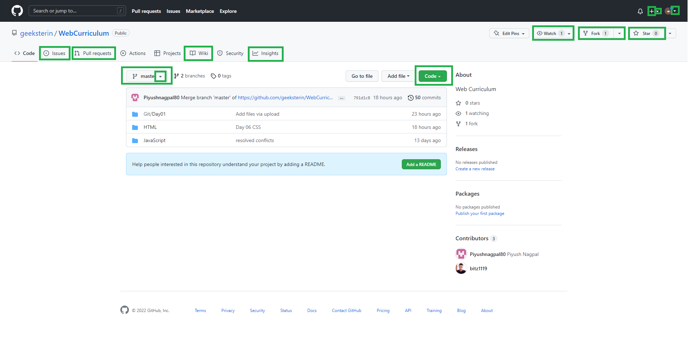
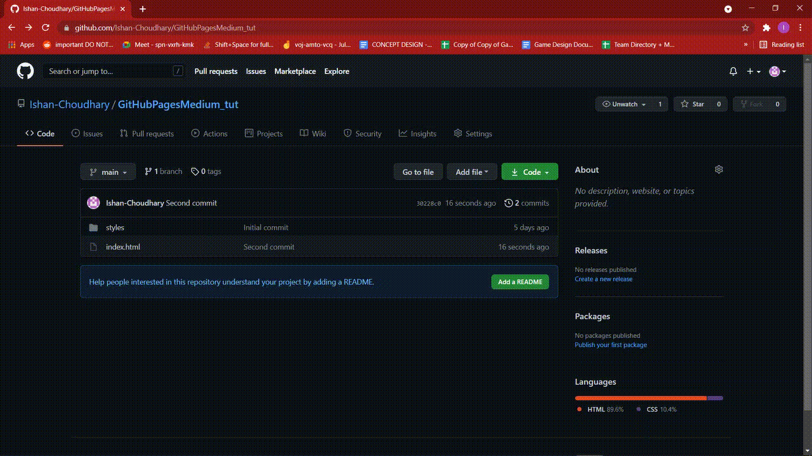

- [Day 2](#day-2)
    - [1. Initialize Git](#1-initialize-git)
    - [2. Add file to the staging area](#2-add-file-to-the-staging-area)
    - [3. Unstage a file](#3-unstage-a-file)
    - [4. Commit the changes](#4-commit-the-changes)
    - [5. Creating a branch](#5-creating-a-branch)
    - [6. Create account on GitHub](#6-create-account-on-github)
    - [7. Create Repository on GitHub](#7-create-repository-on-github)
    - [8. Connecting git with remote repository](#8-connecting-git-with-remote-repository)
    - [9. Push](#9-push)
    - [10. Pull](#10-pull)
    - [11. Git clone](#11-git-clone)
    - [12. The .gitignore file](#12-the-gitignore-file)
    - [13 Forking](#13-forking)
 - [Git repository user interface features](#git-repository-user-interface-features)

  - [Git Basics Exercises](#git-basics-exercises)
  # Day 2


### 1. Initialize Git
To create a new repo, you'll use the git init command. git init is a one-time command you use during the initial setup of a new repo. Executing this command will create a new .git subdirectory in your current working directory. 
```shell
   git init
```
Once, the repository is initialized git tracks the changes in the files and folders of the project.
### 2. Add file to the staging area
The git add command adds a change in the working directory to the staging area. It tells Git that you want to include updates to a particular file in the next commit. However, git add doesn't really affect the repository in any significant way—changes are not actually recorded until you run git commit.

To add a single file, we use the _git add_ command followed by a file name

```shell
   git add filename
```
To add multiple files using their file names using the command _git add_ followed by file names

```shell
   git add filename1 filename2
```
Sometimes, we may make a lot of changes, and adding files one by one is tiring and not product. Therefore, we can use a short and product way. The _git add_ command followed by a dot allows adding files and folders at once to the stage area. Remember, there is a space between the add and the dot.

To add all files and folders at once

```shell
   git add .
```
### 3. Unstage a file
The easiest way to unstage files on Git is to use the “git reset” command and specify the file you want to unstage.
By default, the commit parameter is optional : if you don’t specify it, it will be referring to HEAD.
```shell
    git reset HEAD filename
```
### 4. Commit the changes
The git commit command is one of the core primary functions of Git. Prior use of the git add command is required to select the changes that will be staged for the next commit. Then git commit is used to create a snapshot of the staged changes along a timeline of a Git projects history. 
```shell
   git commit -m 'your message'
```
Your commit message has to be associated with the changes or modifications you make.
### 5. Creating a branch
The git branch command can be used to create a new branch. When you want to start a new feature, you create a new branch off main using git branch new_branch. Once created you can then use git checkout new_branch to switch to that branch.
- Only to create branch

```shell
    git branch  branch-name
```

- To create and checkout to the branch at the same time:

```shell
    git checkout -b branch-name
```

To switch between branches:

```shell
    git checkout main
    git checkout branch-name
```

To list down all the branches:

```shell
    git branch
```
### 6. Create account on GitHub
create an account on GitHub and sign in using your emails and password
[How to Create an Account on GitHub](https://www.wikihow.com/Create-an-Account-on-GitHub)
- GitHub
  Sign up on [GitHub](https://github.com/)
  
### 7. Create Repository on GitHub
To put your project up on GitHub, you will need to create a repository for it.
[Create a repository](https://docs.github.com/en/get-started/quickstart/create-a-repo)

### 8. Connecting git with remote repository
In this step, you will connect your local git repository with your remote GitHub repository

```shell
    git remote add origin remote_repository_ul
```
The word origin could be any word. It is a means to assign the repository URL.
If this is step is passed without error, you are ready to push it to your remote GitHub repository. Push means actually uploading what you have on your local to remote repository.
  [How to connect to a remote Git repository?](https://stackoverflow.com/questions/20291731/how-to-connect-to-a-remote-git-repository)
  
### 9. Push
git push updates the remote branch with local commits. It is one of the four commands in Git that prompts interaction with the remote repository. You can also think of git push as update or publish.
Before you push(upload), please commits any changes and if it is ready push your files to your remote GitHub repository using the following command.

```shell
    git push -u origin master
```
### 10. Pull
git pull updates your current local working branch, and all of the remote tracking branches. It's a good idea to run git pull regularly on the branches you are working on locally.

Without git pull, (or the effect of it,) your local branch wouldn't have any of the updates that are present on the remote.
```shell
git pull 'remote_name' 'branch_name'.
```
### 11. Git clone
git clone is primarily used to point to an existing repo and make a clone or copy of that repo at in a new directory, at another location. The original repository can be located on the local filesystem or on remote machine accessible supported protocols. The git clone command copies an existing Git repository.

```sh
Shreya@DESKTOP-VSQ7BAB MINGW64 ~ (master)
$ cd Desktop/

Shreya@DESKTOP-VSQ7BAB MINGW64 ~/Desktop (master)
$ git clone https://github.com/geeksterin/WebCurriculum
```
### 12. The .gitignore file
The .gitignore file is a text file that tells Git which files or folders to ignore in a project.
A local .gitignore file is usually placed in the root directory of a project. You can also create a global .gitignore file and any entries in that file will be ignored in all of your Git repositories.
The .ignore file

```sh
test
personal-data
example.txt
sensitive-info.txt
```
### 13. Forking
A fork is a copy of a repository that you manage. Forks let you make changes to a project without affecting the original repository. You can fetch updates from or submit changes to the original repository with pull requests.

## Git repository user interface features
Learn about the features of your GitHub account and the accessible repositories.
Account and repository settings are available in Git. Explore the features that are offered.



## Github pages
Hosted website directly from your GitHub repository. You can edit, push your changes and make it live.




# Git Basics Exercises - 1
- Initialize an empty git repository.
- Add first.txt to the staging area.
- Commit with the message "adding first.txt".
- Check out your commit with git log.
- Create another file called second.txt.
- Add second.txt to the staging area.
- Commit with the message "adding second.txt"
- Remove the first.txt file
- Add this change to the staging area
- Commit with the message "removing first.txt"
- Check out your commits using git log
- Create a github repository with your own name
- Push your code to same repository
- Host the repository on github pages

# Git Basics Exercises - 2
- fork a website [portfolio page]
- clone that website
- host on github pages


Give yourself a pat on the back if you've completed this far🎉.


You have successfully finished Geekster's GitHub course.


Now you have a fair knowledge of git and GitHub, don't forget to get your hands dirty with these commands.


