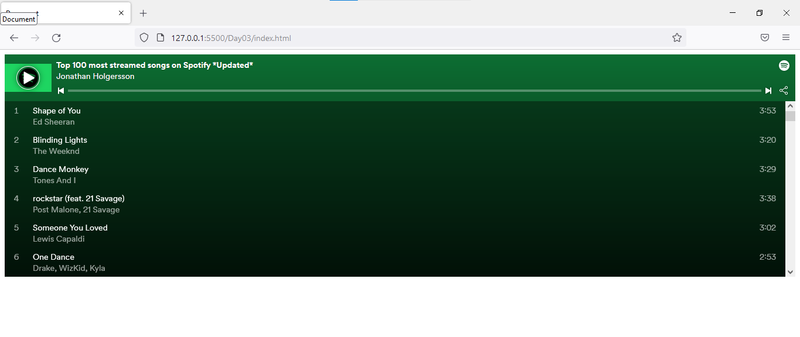
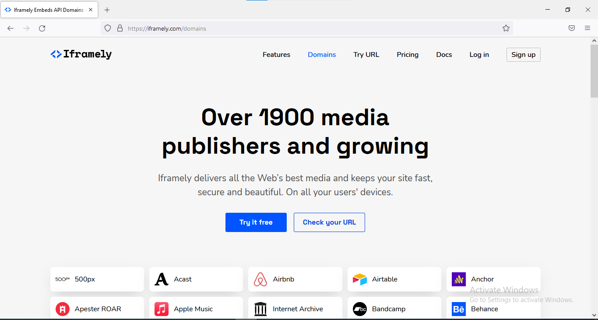
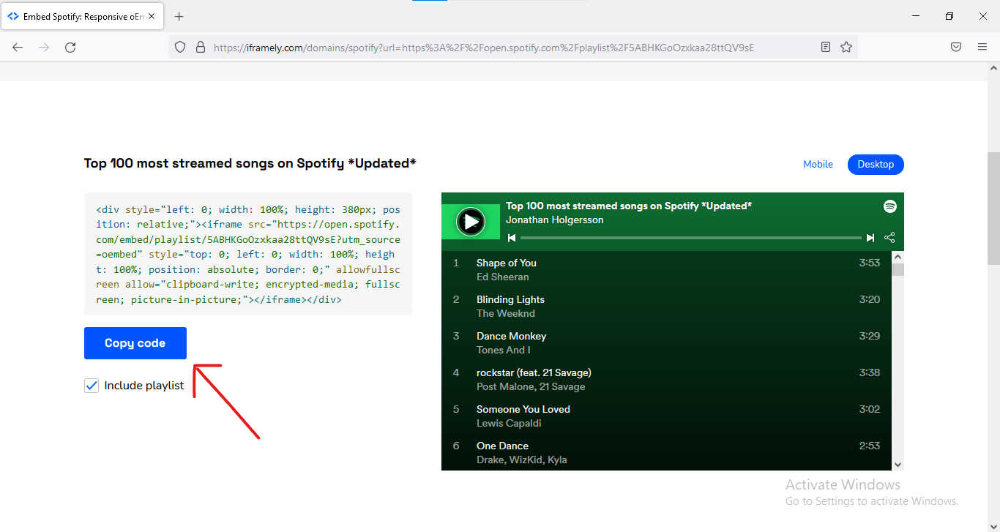

- [iFrames](#iframes)
- [Project](#project)

# iFrames

Q. Ever wondered how we can add a interactive spotify playlist to our webpage?

In this lecture we will see how to add or embed a interactive spotify playlist on our webpage.

**Final Result**



Now lets see how we did it !

We did it with the help of iframely domains,

1. So Go to [https://iframely.com/domains](https://iframely.com/domains)

2. you would be landed on this page:



3. Select Spotify media from the given option :


4. Now you are able to see something like this.


5. so just copy paste the link of playlist you want in your website.


6. Final step copy this code and paste in your html body to see the result



now, demo HTML Code

```html
<!DOCTYPE html>
<html lang="en">
<head>
    <meta charset="UTF-8">
    <meta http-equiv="X-UA-Compatible" content="IE=edge">
    <meta name="viewport" content="width=device-width, initial-scale=1.0">
    <title>Document</title>
</head>
<body>
    <!-- paste the copied code here -->
    <div style="left: 0; width: 100%; height: 380px; position: relative;"><iframe src="https://open.spotify.com/embed/playlist/5ABHKGoOzxkaa28ttQV9sE?utm_source=oembed" style="top: 0; left: 0; width: 100%; height: 100%; position: absolute; border: 0;" allowfullscreen allow="clipboard-write; encrypted-media; fullscreen; picture-in-picture;"></iframe></div>

</body>
</html>
```

**Final Result**


# Project

Now lets make a tribute page and lets see few more iframe tags

```html
<!DOCTYPE html>
<html lang="en">
<head>
    <meta charset="UTF-8">
    <meta http-equiv="X-UA-Compatible" content="IE=edge">
    <meta name="viewport" content="width=device-width, initial-scale=1.0">
    <title>Tribute Page</title>
</head>
<body>
    <center>
        <div>
            <h1>🏏 Virat Kohli 🏏</h1>
            <p>A spunky, chubby teenager with gelled hair shot to fame after leading India to glory in the Under-19 World Cup at Kuala Lumpur in early 2008. In an Indian team filled with saint-like icons worthy of their own hagiographies, Virat Kohli, with his most un-Indian, 'bad-boy' intensity, would clearly be an outcast.</p>
        </div>
        <h2>Tweets 🐦</h2>
        <div>
            <blockquote class="twitter-tweet"><p lang="und" dir="ltr">🌊☀️ <a href="https://t.co/VBVvlIIvLh">pic.twitter.com/VBVvlIIvLh</a></p>&mdash; Virat Kohli (@imVkohli) <a href="https://twitter.com/imVkohli/status/1535961086012235776?ref_src=twsrc%5Etfw">June 12, 2022</a></blockquote> <script async src="https://platform.twitter.com/widgets.js" charset="utf-8"></script>
        </div>
        <div>
            <h2>Images 🖼️</h2>
            
        </div>

        <!-- adding instagram account to webpage using iframes-->
        <div>
            <h2>Instagram 🖼️</h2>
            <iframe width="320" height="440" src="https://www.instagram.com/p/CedeaFMAf0n/embed" frameborder="0"></iframe>
        </div>

        <!-- adding google maps to webpage using iframes-->
        <h2> Google Map </h2>
        <iframe src="https://www.google.com/maps/embed?pb=!1m18!1m12!1m3!1d3549.400553850174!2d78.03995351503737!3d27.175144783015277!2m3!1f0!2f0!3f0!3m2!1i1024!2i768!4f13.1!3m3!1m2!1s0x39747121d702ff6d%3A0xdd2ae4803f767dde!2sTaj%20Mahal!5e0!3m2!1sen!2sin!4v1655138264150!5m2!1sen!2sin" width="400" height="400" style="border:0;" allowfullscreen="" loading="lazy" referrerpolicy="no-referrer-when-downgrade"></iframe>

        <!-- can we embed spotify -->
        <!-- yes we have learnt it above -->
        <h2>Favourite Songs</h2>
        <div style="left: 0; width: 100%; height: 80px; position: relative;"><iframe src="https://open.spotify.com/embed/playlist/5a2OuIJ1kEttA8X3PaewlI?utm_source=oembed" style="top: 0; left: 0; width: 100%; height: 100%; position: absolute; border: 0;" allowfullscreen allow="clipboard-write; encrypted-media; fullscreen; picture-in-picture;"></iframe></div>
    </center>


</body>
</html>
```

## Preview


