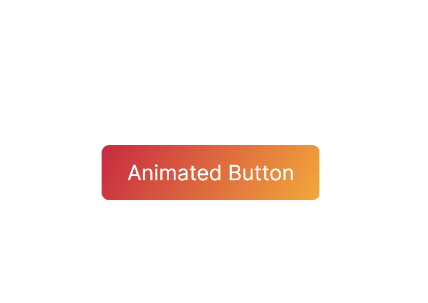

## CSS3 Properties

**border-radius**

```css
-webkit-border-radius: 4px;
-moz-border-radius: 4px;
border-radius: 4px;
```

Allows rounded corners in elements. Can also be used to create circles.

*Support: IE9+*

**box-shadow**

```css
-webkit-box-shadow: 1px 1px 3px #292929;
-moz-box-shadow: 1px 1px 3px #292929;
box-shadow: 1px 1px 3px #292929;
```

The box-shadow property allows us to easily implement multiple drop shadows (outer or inner) on box elements, specifying values for color, size, blur and offset.

box-shadow accepts four parameters: x-offset, y-offset, blur, color of shadow.

* The first value defines the horizontal offset of the shadow, with a positive value offsetting the shadow to the right of the element, and a negative value to the left.
* The second value defines the vertical offset of the shadow, with a positive value offsetting the shadow from the bottom of the element, and a negative value from the top.
* If supplied, an optional third value defines the blur distance of the shadow. Only positive values are allowed, and the larger the value, the more the shadow’s edge is blurred.
* An optional fourth value can be supplied to define the spread distance of the shadow. A positive value will cause the shadow shape to expand in all directions, while a negative value will cause the shadow shape to contract.

An optional ‘inset’ keyword can be supplied, preceding the length and color values. If present, this keyword causes the shadow to be drawn inside the element.

```css
-webkit-box-shadow: 0 0 20px #333 inset;
-moz-box-shadow: 0 0 20px #333 inset;
box-shadow: 0 0 20px #333 inset;
```

text-shadow has the same set of properties as well.

It allows you to immediately apply depth to your elements. We can apply multiple shadows by using comma as a separator.

*Support: IE9+*

*More reading:*

[Box-shadow, one of CSS3’s best new features](http://www.css3.info/preview/box-shadow/)

[CSS Almanac: box-shadow](https://css-tricks.com/almanac/properties/b/box-shadow/)

**text-shadow**

```css
color: #fff /* text color to white */
text-shadow: 0 0 50px #333;
```

Text shadows are like box shadows except that they are shadows for text rather than the whole element. Luckily, there is no vendor prefix necessary for text shadow.

The options for text shadow are the same as for box-shadow except that there is *no inset* text shadow support.

As with box shadows, it is possible to have multiple text shadows just by separating them with commas. Here is an example that creates a flaming text effect.

```css
text-shadow: 0 0 4px #ccc,
             0 -5px 4px #ff3,
             2px -10px 6px #fd3,
             -2px -15px 11px #f80,
             2px -18px 18px #f20;
```

*Support: IE10+*

**Gradients**

Just as you can declare the background of an element to be a solid color in CSS, you can also declare that background to be a gradient. Using gradients declared in CSS, rather using an actual image file, is better for control and performance.

Gradients are typically one color that fades into another, but in CSS you can control every aspect of how that happens, from the direction to the colors (as many as you want) to where those color changes happen.

```css
.gradient {
  /* can be treated like a fallback */
  background-color: red;

  /* will be "on top", if browser supports it */
  background-image: linear-gradient(red, orange);

  /* these will reset other properties, like background-position, but it does know what you mean */
  background: red;
  background: linear-gradient(red, orange);
}
```

*Support: IE10+*

***Linear Gradient***

Perhaps the most common and useful type of gradient is the linear-gradient(). The gradients "axis" can go from left-to-right, top-to-bottom, or at any angle you chose. Not declaring an angle will assume top-to-bottom.
To make it left-to-right, you pass an additional parameter at the beginning of the linear-gradient() function starting with the word "to", indicating the direction, like "to right". This "to" syntax works for corners as well.
You aren't limited to just two colors either. In fact you can have as many comma-separated colors as you want.
You can also declare where you want any particular color to "start". Those are called "color-stops". Say you wanted yellow to take up the majority of the space, but red only a little bit in the beginning, you could make the yellow color-stop pretty early:

```css
.gradient {
  height: 100px;
  background-image:
    linear-gradient(
      to right,
      red,
      yellow 10%
    );
}
```

***Gotchas***

* We tend to think of gradients as fading colors, but if you have two color stops that are the same, [you can make a solid color instantly change to another solid color](http://codepen.io/chriscoyier/pen/csgoD). This can be useful for declaring a full-height background that simulates columns.

* There are three different syntaxes that browsers have supported:

  - Old: original WebKit-only way, with stuff like from() and color-stop()

  - Tweener: old angle system, e.g. "left"

  - New: new angle system, e.g. "to right"

The way degrees work in the OLD vs NEW syntax is a bit different. The OLD (and TWEENER - usually prefixed) way defines 0deg and left-to-right and proceeds counter-clockwise, while the NEW (usually unprefixed) way defines 0deg as bottom-to-top and proceeds clockwise.

OLD (or TWEENER) = (450 - new) % 360

or even simpler:

NEW = 90 - OLD
OLD = 90 - NEW

like:

OLD linear-gradient(135deg, red, blue)
NEW linear-gradient(315deg, red, blue)

***Radial Gradients***

Radial gradient differ from linear in that they start at a single point and emanate outwards. Gradients are often used to simulate a lighting, which as we know isn't always straight, so they can be useful to make a gradient seem even more natural.

The default is for the first color to start in the (center center) of the element and fade to the end color toward the edge of the element. The fade happens at an equal rate no matter which direction. The default gradient shape is an ellipse.

The possible values for fade  are: closest-corner, closest-side, farthest-corner, farthest-side. You can think of it like: "I want this radial gradient to fade from the center point to the __________, and everywhere else fills in to accommodate that."
A radial gradient doesn't have to start at the default center either, you can specify a certain point by using "at ______" as part of the first parameter.

***Gotchas***

* There are again three different syntaxes that browsers have supported:

  - Old: Prefixed with -webkit-, stuff like from() and color-stop()

  - Tweener: First param was location of center. That will completely break now in browsers that support new syntax unprefixed, so make sure any tweener syntax is prefixed.

  - New: Verbose first param, like "circle closest-corner at top right"

* It is recommended to used autoprefixers like [postcss](https://github.com/postcss/autoprefixer) to handle vendor prefixes to make it work across different browsers consistently.

***Repeating Gradients***

The size of the gradient is determined by the final color stop. If that's at 20px, the size of the gradient (which then repeats) is a 20px by 20px square.

```css
.repeat {
  background-image:
    repeating-linear-gradient(
      45deg,
      yellow,
      yellow 10px,
      red 10px,
      red 20px /* determines size */
    );
}
```

They can be used with both linear and radial varieties.

There is a trick, with non-repeating gradients, to create the gradient in such a way that if it was a little tiny rectangle, it would line up with other little tiny rectangle versions of itself to create a repeating pattern. So essentially create that gradient and set the background-size to make that little tiny rectangle. That made it easy to make stripes, which you could then rotate or whatever.

*More reading:*

[CSS Gradients](https://css-tricks.com/css3-gradients/)

## CSS3 Transitions

A CSS transition allows you to change the property of an element over a given duration that you set.

* transition-property: The property to be transitioned (in this case, the background property)
* transition-duration: How long the transition should last (0.3 seconds)
* transition-timing-function: How fast the transition happens over time (ease)

The timing function value allows the speed of the transition to change over time by defining one of six possibilities: *ease, linear, ease-in, ease-out, ease-in-out, and cubic-bezier* (which allows you to define your own timing curve).

You may want the transition to also happen on the :focus or :active pseudo-classes of the link as well. Instead of having to add the transition property stack to each of those declarations, the transition instructions are attached to the normal state and therefore declared only once.

```css
a.foo {
  padding: 5px 10px;
  background: #9c3;
  -webkit-transition: background .3s ease,
    color 0.2s linear;
  -moz-transition: background .3s ease,
    color 0.2s linear;
  -o-transition: background .3s ease, color 0.2s linear;
  transition: background .3s ease, color 0.2s linear;
}
a.foo:hover,
a.foo:focus {
  color: #030;
  background: #690;
}
```

Let’s say that along with the background color, we also want to change the link’s text color and transition that as well. We can do that by stringing multiple transitions together, separated by a comma. Each can have their varying duration and timing functions. An alternative to listing multiple properties is using the all value. This will transition all available properties.

Another basic use of changing states is to change the background of an input box on focus.

```css
input.ourInputBox:focus{
 -webkit-transition:background-color 0.5s linear;
 background:#CCC;
}
```

This time, we put the transition declaration into the hover state, so that we aren’t adding additional unnecessary classes to the CSS. We apply the transition once the input box acquires focus.

*More reading:*

[Understanding CSS3 Transitions](http://alistapart.com/article/understanding-css3-transitions)

[CSS Fundamentals: CSS3 Transitions](http://code.tutsplus.com/tutorials/css-fundamentals-css3-transitions--pre-10922)

## CSS Animations

While CSS transitions are all about altering element properties as they move from state to state, CSS animations are dependent on keyframes and animation properties.

* keyframes: Used to define the styles an element will have at various times.
* animation properties: Used to assign @keyframes to a specific element and determine how it is animated.

***Keyframes***

Keyframes are the foundation of CSS animations. They define what the animation looks like at each stage of the animation timeline. Each @keyframes is composed of:

- Name of the animation: A name that describes the animation, for example, bounceIn.

- Stages of the animation: Each stage of the animation is represented as a percentage. 0% represents the beginning state of the animation. 100% represents the ending state of the animation. Multiple intermediate states can be added in between.

- CSS Properties: The CSS properties defined for each stage of the animation timeline.

Let’s take a look at a simple @keyframes I’ve named “bounceIn”. This @keyframes has three stages. At the first stage (0%), the element is at opacity 0 and scaled down to 10 percent of its default size, using CSS transform scale. At the second stage (60%) the element fades in to full opacity and grows to 120 percent of its default size. At the final stage (100%), it scales down slightly and returns to its default size.

The @keyframes are added to your main CSS file.

```css
@keyframes bounceIn {
  0% {
    transform: scale(0.1);
    opacity: 0;
  }
  60% {
    transform: scale(1.2);
    opacity: 1;
  }
  100% {
    transform: scale(1);
  }
}
```

***Animation Properties***

Once the @keyframes are defined, the animation properties must be added in order for your animation to function.

Animation properties do two things:

* They assign the @keyframes to the elements you want to animate.
* They define how it is animated.

The animation properties are added to the CSS selectors(or elements) that you want to animate, You must add the following two animation properties for the animation to take effect.

* animation-name: The name of the animation defined in the @keyframes.
* animation-duration: The duration of the animations, in seconds (eg. 5s) or milliseconds (eg. 200ms).

Continuing with the above bounceIn example, we’ll add animation-name and animation-duration to the div that we want to animate.

```css
div {
  animation-duration: 2s;
  animation-name: bounceIn;
}
```

Shorthand syntax:
```css
div {
  animation: bounceIn 2s;
}
```

By adding both the @keyframes and the animation properties, we have a simple animation!

In addition to the required animation-name and animation-duration properties, you can further customize and create complex animations using the following properties:

* animation-timing-function – specifies the speed curve of the animation.
* animation-delay – specifies a delay for the start of an animation.
* animation-iteration-count – specifies the number of times an animation should be played.
* animation-direction – specifies whether an animation should play in reverse direction or alternate cycles.
* animation-fill-mode – specifies a style for the element when the animation is not playing. Such as when it is finished or when it has a delay.
* animation-play-state – specifies whether the animation is running or paused.

Order used in shorthand syntax:

animation: [animation-name] [animation-duration] [animation-timing-function]
[animation-delay] [animation-iteration-count] [animation-direction]
[animation-fill-mode] [animation-play-state];

To add multiple animations to a selector, you simply separate the values with a comma. Here’s an example:

```css
.div {
  animation: slideIn 2s, rotate 1.75s;
}
```

*More reading:*

[An Introduction to CSS Transitions & Animations](https://www.elegantthemes.com/blog/tips-tricks/an-introduction-to-css-transitions-animations)

[CSS Animation for Beginners](https://robots.thoughtbot.com/css-animation-for-beginners)

[Simple CSS3 Transitions, Transforms, & Animations Compilation](http://callmenick.com/post/simple-css3-transitions-transforms-animations-compilation)

[Learn to Code Advanced HTML & CSS](http://learn.shayhowe.com/advanced-html-css/performance-organization/)

## Scalable Vector Graphics (SVG)

SVG stands for scalable vector graphics. It is an XML-based format that supports animation and interactivity.
In other words, SVG is a technology that allows us to create graphics by writing a code. Moreover, it is scalable. While non-vector graphics like PNG and JPEG have fixed sizes and cannot be scaled without loosing quality, SVG can be mathematically scaled to any size.

We can use ".svg" file in our code by setting it as an image source just like any other image "< img src='say_hello.svg'>". But it's not so interesting.
One of the greatest things about SVG is that it is actually text file in XML format. So we can open it, read it and interact with it. We can take our SVG code, put in DOM and play with it - change elements parameters like position, background color or font family using JavaScript and CSS. Moreover, each element of SVG can be animated. And it's really awesome.

So, basically, we should always use SVG graphics instead of PNG or JPEG, when we are talking about basic shapes, logos and vector graphic.

Here's a simple red circle SVG
```css
<svg width="100" height="100">
    <circle cx="50" cy="50" r="40" fill="red" />
</svg>
```

***Common element parameters***

Usually graphs starts (x,y = 0) from bottom left corner. In SVG start point is top left corner.

Each SVG shape (element) has some basic parameters:
* X - X coordinate of top left corner of the element
* Y - Y coordinate of top left corner of the element
* Fill - element background color.
* Fill-opacity - opacity of background color
* Stroke - element border color.
* Stroke-width - element border size.

***Pros:***
  - Resolution independent: Scalability without changing the image quality. It is widely used for devices with screens Retina and those close to them.
  - Small size. SVG image elements take up much less space than their twins created in raster format.
  - Flexibility. With CSS, you can quickly change the graphics settings on the site, such as background color or the position of the logo on the page. To do this, you can edit the file in any text editor.
  - It’s possible to view the contents of the SVG file in any browser (IE, Chrome, Opera, FireFox, Safari, etc.).
  - No unnecessary HTTP requests, unlike using an img tag
  - SEO friendly: text labels, descriptions can be searched by search engines.
  - We have scripting control for custom interactive events and animation.

***Cons:***
  - The file size is growing very fast, if the object consists of a large number of small elements.
  - It’s impossible to read a part of the graphic object, only the entire object and it slows you down.

*Support: IE9+*

*More reading:*

[Introduction to SVG](http://tonyfreed.com/blog/introduction-to-svg)

[An introduction to SVG](http://engageinteractive.co.uk/blog/an-introduction-to-svg)

[The Simple Intro to SVG Animation](http://davidwalsh.name/svg-animation)

[Icon fonts vs SVG - which is the best option?](http://www.creativebloq.com/web-design/icon-fonts-vs-svg-101413211)

*Videos:*

[Using SVG - Intro](https://www.youtube.com/watch?v=vvuH6qS2M5Q)

[SVG Tutorials - Playlist](https://www.youtube.com/watch?v=PQxtlY19kto&list=PLL8woMHwr36F2tCFnWTbVBQAGQ6nTcXOO)

[Working with SVG, A Primer - Sara Soueidan](https://www.youtube.com/watch?v=uKNX23lvnPo)

[You Don't Know SVG - Dmitry Baranovskiy](https://www.youtube.com/watch?v=SeLOt_BRAqc)

[SVG is for Everybody - Chris Coyier](https://www.youtube.com/watch?v=w83XRCkMtHQ)

[Building Better Interfaces With SVG - Sara Soueidan](https://www.youtube.com/watch?v=lMFfTRiipOQ)

[SVG Lessons I Learned The Hard Way - Sara Soueidan](https://www.youtube.com/watch?v=NkLDuPf5P0A)


# Project

## Animate the background gradient of a button.
