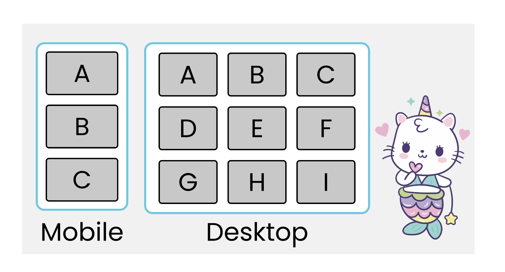

## CSS3 Media queries

CSS Media Queries are a feature in CSS3 which allows you to specify when certain CSS rules should be applied. This allows you to apply a special CSS for mobile, or adjust a layout for print.

There are three ways to invoke media-query-dependent styles.

* First of all, as stylesheets in the link element of HTML or XHTML:

```html
<link rel="stylesheet" type="text/css" media="all and (color)" href="/style.css">
```

Secondly, in XML:

```html
<?xml-stylesheet media="all and (color)" rel="stylesheet" href="/style.css" ?>
```

And finally, in CSS stylesheets using @import rules:

```css
@import url("/style.css") all and (color);
```

Or using @media rules:

```css
@media all and (color) { /* one or more rule sets... */ }
```

There are currently 13 media features catered for in the specification: width, height, device-width, device-height, orientation, aspect-ratio,device-aspect-ratio, color, color-index, monochrome, resolution, scan, and grid. All but orientation, scan, and grid can accept min- and max- prefixes as well.

## Responsive Web Design

***Setting the viewport***

```html
<meta name="viewport" content="width=device-width, initial-scale=1.0">
```

A meta viewport element gives the browser instructions on how to control the page's dimensions and scaling.

The width=device-width part sets the width of the page to follow the screen-width of the device (which will vary depending on the device).

The initial-scale=1.0 part sets the initial zoom level when the page is first loaded by the browser.

***Gotchas***

1. Do NOT use large fixed width elements - If an image is displayed at a width wider than the viewport it can cause the viewport to scroll horizontally.

2. Do NOT let the content rely on a particular viewport width to render well - Since screen dimensions and width in CSS pixels vary widely between devices, content should not rely on a particular viewport width to render well.

3. Use CSS media queries to apply different styling for small and large screens - Setting large absolute CSS widths for page elements, will cause the element to be too wide for the viewport on a smaller device. Instead, consider using relative width values, such as width: 100%. Also, be careful of using large absolute positioning values. It may cause the element to fall outside the viewport on small devices.

***Building a Responsive Grid-View***

A responsive grid-view often has 12 columns, and has a total width of 100%, and will shrink and expand as you resize the browser window.

First ensure that all HTML elements have the [box-sizing](https://css-tricks.com/box-sizing/) property set to border-box. This makes sure that the padding and border are included in the total width and height of the elements.

Add the following code in your CSS:

```css
* {
    box-sizing: border-box;
}
```

***Responsive Images***

Images will be responsive and scale up and down if the width property is set to 100%.
**A better option would be to set max-width property to 100% since the image will scale down if it has to, but never scale up to be larger than its original size.**

Background images can also respond to resizing and scaling.

* If the background-size property is set to "contain", the background image will scale, and try to fit the content area. However, the image will keep its aspect ratio
* If the background-size property is set to "100% 100%", the background image will stretch to cover the entire content area.
* If the background-size property is set to "cover", the background image will scale to cover the entire content area. The "cover" value keeps the aspect ratio, and some part of the background image may be clipped

A large image can be perfect on a big computer screen, but useless on a small device. To reduce the load, you can use media queries to display different images on different devices.

You can use the media query min-device-width, instead of min-width, which checks the device width, instead of the browser width. Then the image will not change when you resize the browser window:

```css
/* For devices smaller than 400px: */
body {
    background-image: url('img_smallflower.jpg');
}

/* For devices 400px and larger: */
@media only screen and (min-device-width: 400px) {
    body {
        background-image: url('img_flowers.jpg');
    }
}
```

HTML5 introduced the picture element, which lets you define more than one image. (No IE support :(  .. only Edge 13+)

The picture element works similar to the video and audio elements. You set up different sources, and the first source that fits the preferences is the one being used:

```css
<picture>
  <source srcset="img_smallflower.jpg" media="(max-width: 400px)">
  <source srcset="img_flowers.jpg">
  
</picture>
```

The srcset attribute is required, and defines the source of the image. The media attribute is optional, and accepts the media queries you find in CSS @media rule. You should also define an img element for browsers that do not support the picture element (good fallback option).

***Responsive Videos***

* Using The width Property

  - If the width property is set to 100%, the video player will be responsive and scale up and down. However, it can be scaled up to be larger than its original size. A better solution, in many cases, will be to use the max-width property instead.

  ```css
  video {
      max-width: 100%;
      height: auto;
  }
  ```

*More reading:*

[w3schools - Responsive Web Design](http://www.w3schools.com/css/css_rwd_intro.asp)

[9 basic principles of responsive web design](http://blog.froont.com/9-basic-principles-of-responsive-web-design/)

# Projects

## Build a Card Layout.
