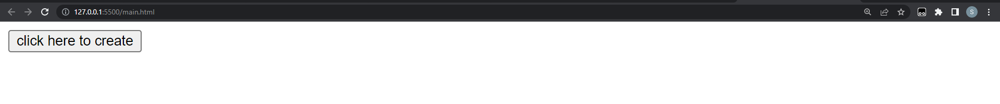
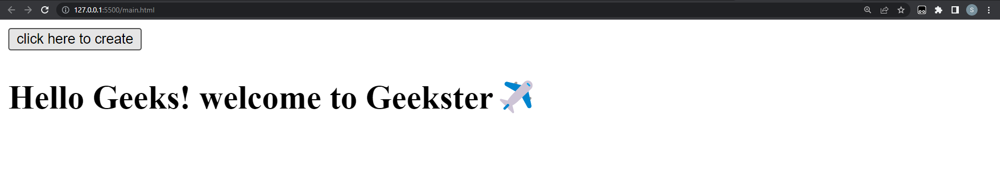
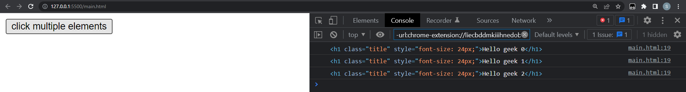
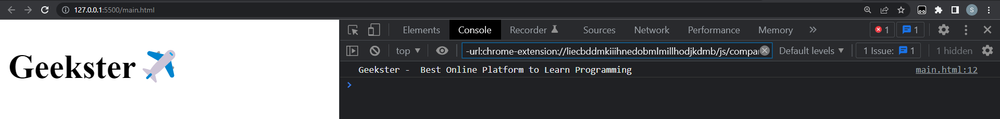
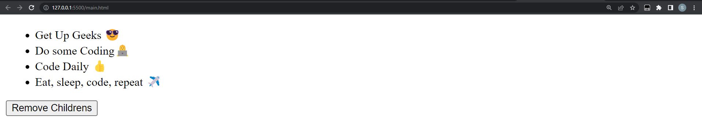
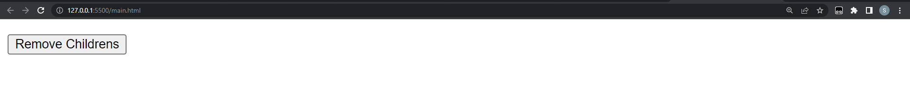
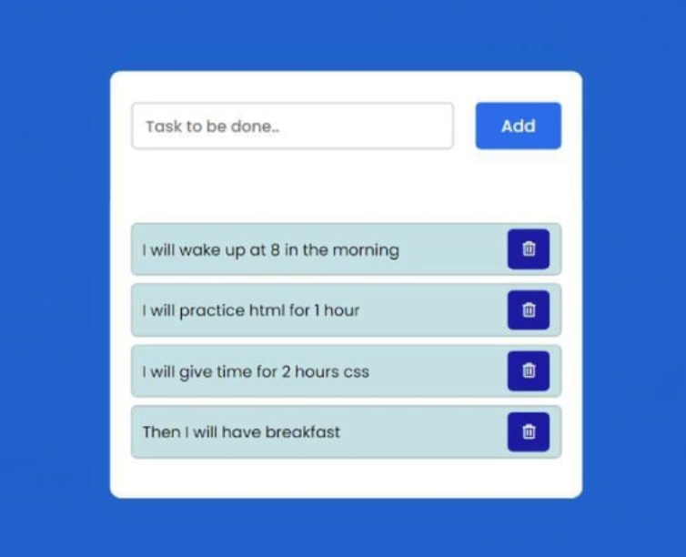

# Learn DOCUMENT OBJECT MODEL(DOM) with Geekster

- [Day 2](#day-2)
- [DOM(Document Object Model)-Day 2](#domdocument-object-model-day-2)
  - [Creating an Element](#creating-an-element)
  - [Creating elements](#creating-elements)
  - [Appending child to a parent element](#appending-child-to-a-parent-element)
  - [Removing a child element from a parent node](#removing-a-child-element-from-a-parent-node)
  - [Exercises](#exercises)

# Day 2
## DOM(Document Object Model)-Day 2

### Creating an Element
In an HTML document, the document.createElement() method creates the HTML element specified by tagName, or an HTMLUnknownElement if tagName isn't recognized.

**SYNTAX**

```js
document.createElement("elementName");
```
**EXAMPLE**

```html
<!DOCTYPE html>
<html lang="en">
<head>
    <meta charset="UTF-8">
    <meta http-equiv="X-UA-Compatible" content="IE=edge">
    <meta name="viewport" content="width=device-width, initial-scale=1.0">
    <title>Learn DOM with Geekster</title>
</head>
<body>
    
    <button onclick = "create()"> click here to create</button> 
    <script>
        function create() {
            var x = document.createElement("h1");
            var t = document.createTextNode("Hello Geeks! welcome to Geekster✈️");
            x.appendChild(t);
            document.body.appendChild(x);
        }
    </script>
</body>
</html>
```

**OUTPUT**

Before clicking button



After clicking button 



<hr>

### Creating elements

Use a loop to create numerous items. We can generate as many HTML components as we like using the loop.
The various properties of the HTML object can be given values after the element is created.

**EXAMPLE**

```html
<!DOCTYPE html>
<html lang="en">
<head>
    <meta charset="UTF-8">
    <meta http-equiv="X-UA-Compatible" content="IE=edge">
    <meta name="viewport" content="width=device-width, initial-scale=1.0">
    <title>Learn DOM with Geekster</title>
</head>
<body>
    <button onclick="create()"> click multiple elements</button> 
    <script>
        function create() {
            let title
        for (let i = 0; i < 3; i++) {
            title = document.createElement('h1')
            title.className = 'title'
            title.style.fontSize = '24px'
            title.textContent = `Hello geek ${i}`;
            console.log(title)
        }
    }
    </script>
</body>
</html>
```
**OUTPUT**



<hr>

### Appending child to a parent element

The appendChild() is a method of the Node interface. The appendChild() method allows you to add a node to the end of the list of child nodes of a specified parent node.

**SYNTAX**

```js
ParentNode.append( ChildNodesToPrepend);
```
**EXAMPLE**

```html
       <!DOCTYPE html>
       <html lang="en">
       
       <body>
        <h1>Geekster✈️</h1>
       
        <script>
         var parent = document.createElement("div");
         parent.innerHTML = "Geekster - ";
         parent.append(" Best Online Platform to Learn Programming");
         console.log(parent.textContent);
        </script>
       </body>
       
       </html>
       
```
**OUTPUT**

In this example, we have appended some text to innerHTML of the element and the element’s textContent. In console, you can see textContent of parent element.



<hr>

### Removing a child element from a parent node
RemoveChild() and remove() are two methods for removing nodes from their parents, respectively ().
Setting the innerHTML="" property to an empty string also has the same effect of removing all children from a node. It is not recommended to utilise this strategy.

**SYNTAX**

```js
ParentNode.append( ChildNodesToPrepend);
```
**EXAMPLE**

```html
       <!DOCTYPE html>
       <html lang="en">
       
       <body>
        <h1>Geekster✈️</h1>
       
        <script>
         var parent = document.createElement("div");
         parent.innerHTML = "Geekster - ";
         parent.append(" Best Online Platform to Learn Programming");
         console.log(parent.textContent);
        </script>
       </body>
       
       </html>
       
```
**OUTPUT**

Before Clicking on Button:



After Clicking on Button:



<hr>

If you've made it this far, congratulate yourself🎉🎉.

You are incredible, and you are becoming better every day. 

Now that you were aware of how to remove a DOM element when it was no longer required. You gained knowledge of DOM and can now create and develop applications.

## Exercises

Use JavaScript to create a "to-do list" to organize and prioritize your daily routine.


