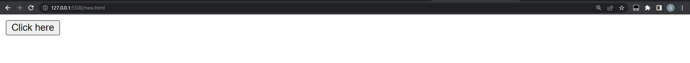
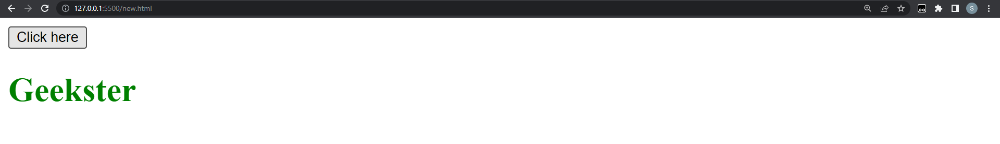
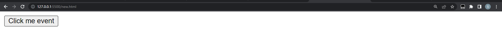
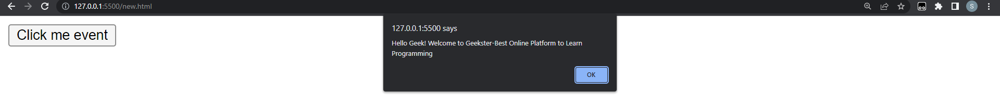
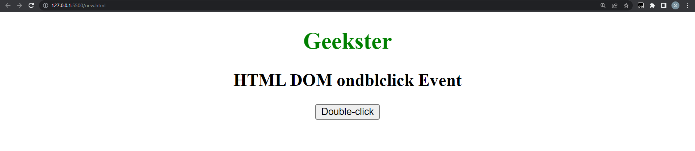
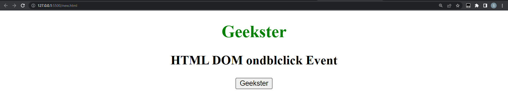
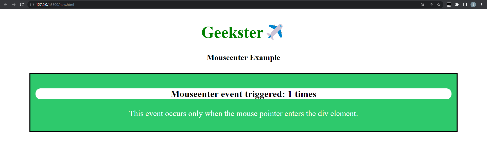
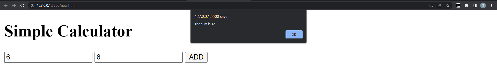
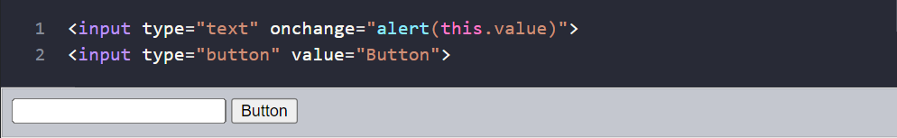
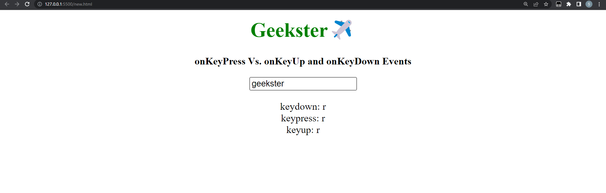

# Learn Event Listeners with Geekster

- [Day 03](#day-03)
	- [DOM(Document Object Model)-Day 3](#domdocument-object-model-day-3)
		- [Event Listeners](#event-listeners)
			- [Click](#click)
			- [Double Click](#double-click)
			- [Mouse enter](#mouse-enter)
		- [Getting value from an input element](#getting-value-from-an-input-element)
		- [input value](#input-value)
			- [input event and change](#input-event-and-change)
			- [blur event](#blur-event)
			- [keypress, keydow and keyup](#keypress-keydow-and-keyup)
	- [Exercises](#exercises)

# Day 03

## DOM(Document Object Model)-Day 3

### Event Listeners

An event listener is a procedure in JavaScript that waits for an event to occur. The simple example of an event is a user clicking the mouse or pressing a key on the keyboard.
The JavaScript function addEventListener() takes the event to listen for and a second parameter that will be called whenever the given event occurs. A single element can have any number of additional event handlers added to it without replacing any already present ones.
Common HTML events:onclick, onchange, onmouseover, onmouseout, onkeydown, onkeyup, onload.

**SYNTAX**

```js
addEventListener(type, listener)
addEventListener(type, listener, options)
addEventListener(type, listener, useCapture)
```

<hr>

## **Click**

Click event handlers are super-common and used all over the place… popups, modals, buttons, animations. Pretty much any time when clicking an element does something on a web page, a click event handler has been used to make the something happen.

##### How does it work?
We won’t get too technical here… we’re just going to look at this from a high level.

- Our JavaScript code tells the browser to pay particular attention to an element (or elements) we specify and listen out for users clicking on that element.

- We can specify the element by using its ID or with a class name if we want to specify multiple elements. We can even specify by element type (e.g. all <button> elements).
  
- When the browser detects a user has clicked on the specified element our JavaScript code tells it to do something. That “something” is stored within a function.
	
```js
addEventListener('click', (event) => {});

onclick = (event) => { };
```

**EXAMPLE**

```html
<!DOCTYPE html>
<html>

<body>
 <button id="try">Click here</button>
 <h1 id="text"></h1>
 <script>
 document.getElementById("try").addEventListener("click", function(){
 document.getElementById("text").innerText = "Geekster";
  document.getElementById("text").style.color ="green";
});
 </script>
</body>

</html>
```

**OUTPUT**

Before clicking button



After clicking button



<hr>

## **onclick**
	
```js
onclick = (event) => { };
```

**EXAMPLE**

```html
<!doctype html>
<html>
<head>
 <script>
 function hiThere() {
  alert('Hello Geek! Welcome to Geekster-Best Online Platform to Learn Programming');
 }
 </script>
</head>
<body>
 <button type="button" onclick="hiThere()">Click me event</button>
</body>
</html>
```

**OUTPUT**

Before clicking button



After clicking button



<hr>	

 ## **Double Click**
	
The dblclick event fires when a pointing device button (such as a mouse's primary button) is double-clicked; that is, when it's rapidly clicked twice on a single element within a very short span of time.

dblclick fires after two click events (and by extension, after two pairs of mousedown and mouseup events).
  
 ```js
addEventListener('dblclick', (event) => {});

ondblclick = (event) => { };
```
	
**EXAMPLE**
	
```html
<!DOCTYPE html>
<html>
<head>
 <title>HTML DOM ondblclick Event</title>
</head>

<body>
 <center>
  <h1 style="color:green">
  Geekster
 </h1>
  <h2>HTML DOM ondblclick Event</h2>
  <button id="demo"
  ondblclick="myFunction()">
   Double-click
  </button>

  <script>
   function myFunction() {
    document.getElementById(
     "demo").innerHTML = "Geekster";
   }
  </script>
 </center>
</body>

</html>

```

**OUTPUT**

Before clicking button



After clicking button



<hr>	

 #### Mouse enter
	
The mouseenter event is fired at an Element when a pointing device (usually a mouse) is initially moved so that its hotspot is within the element at which the event was fired.
	
  ```js
addEventListener('mouseenter', (event) => {});

onmouseenter = (event) => { };
```
**EXAMPLE**

```html
<!DOCTYPE html>
<html>
<head>
	<title>
		mouseenter event
	</title>
	<style>
		body {
			text-align: center;
		}
		h1 {
			color: green;
		}
		div {
			margin: 15px 50px 0px 50px;
			border: 2px solid black;
			padding: 10px;
			text-align: center;
			background-color: #2ec96c;
		}	
		p {
			color: white;
		}
		
		h3 {
			background-color: white;
			border-radius: 10px;
		}
	</style>
	<script>
		function enter(e) {
			document.getElementById("senter").innerHTML++;
		}
	</script>
</head>
<body>
	<h1>Geekster✈️</h1>
	<h4>Mouseenter Example</h4>
	<div class="enter" onmouseenter="enter(this)">
		<h3>Mouseenter event triggered:
		<span id="senter">0</span>
		times
		</h3>
		<p>
		This event occurs only when the mouse pointer enters the div element.
		</p>
	</div>
</body>
</html>

```

**OUTPUT**

Before clicking button


After clicking button



<hr>
  
## Listed here are a few typical HTML events:
	
- click - when the element clicked
- dblclick - when the element double clicked
- mouseenter - when the mouse point enter to the element
- mouseleave - when the mouse pointer leave the element
- mousemove - when the mouse pointer move on the element
- mouseover - when the mouse pointer move on the element
- mouseout -when the mouse pointer out from the element
- input -when value enter to input field
- change -when value change on input field
- blur -when the element is not focused
- keydown - when a key is down
- keyup - when a key is up
- keypress - when we press any key
- onload - when the browser has finished loading a page
  
<hr>
	
### Getting value from an input element

We usually fill forms and forms accept data. Form fields are created using input HTML element. Let us build a small claculator to perform only sum of two numbers.

### input value
	
**EXAMPLE** 
	
```html
<!DOCTYPE html>
<html>
  <head>
  <title>Welcome to Geekster course of Advance JavaScript</title>
  </head>

  <body>
    <h1>Simple Calculator</h1>

    <input type="text" id="no1" placeholder="Enter first number" />
    <input type="text" id="no2" placeholder="Enter second number" />
    <button>ADD</button>

    <script>
      const no1 = document.querySelector('#no1')
      const no2 = document.querySelector('#no2')
      const button = document.querySelector('button')

      let sum
      button.addEventListener('click', () => {
        sum = +no1.value + +no2.value
        alert(`The sum is ${sum}`)
        console.log(sum)
      })
    </script>
  </body>
</html>
```

**OUTPUT**

After clicking button



<hr>
	
#### input event and change
	
 The change event triggers when the element has finished changing.

For text inputs that means that the event occurs when it loses focus.

For instance, while we are typing in the text field below – there’s no event. But when we move the focus somewhere else, for instance, click on a button – there will be a change event:
	


### blur event
	
In contrast to _input_ or _change_, the _blur_ event occur when the input field is not on focus.

```js
<!DOCTYPE html>
<html>

<head>
    <title>Welcome to Geekster course of Advance JavaScript</title>
</head>

<body>
    <h1>Giving feedback using blur event</h1>

    <input type="text" id="mass" placeholder="say something" />
    <p></p>

    <script>
        const input = document.querySelector('input')
        const p = document.querySelector('p')

        input.addEventListener('blur', (e) => {
            p.textContent = 'Field is required'
            p.style.color = 'red'

        })
    </script>
</body>

</html>
```

#### keypress, keydow and keyup
	
  We can access all the key numbers of the keyboard using different event listener types. Let us use keypress and get the keyCode of each keyboard keys.

```html
<html>
<body style="text-align:center;">
	<h1 style="color:green;">
		Geekster✈️
	</h1>
	<p>
		<b>onKeyPress Vs. onKeyUp
			and onKeyDown Events</b>
	</p>
	<input type="text" id="field" placeholder="Type here">
	<p id="status"></p>
	<script>
		// Script to test which key
		// event gets triggered
		// when a key is pressed
		var key_pressed =
			document.getElementById('field');
		key_pressed
			.addEventListener("keydown", onKeyDown);
		key_pressed
			.addEventListener("keypress", onKeyPress);
		key_pressed
			.addEventListener("keyup", onKeyUp);
		function onKeyDown(event) {
			document.getElementById("status")
				.innerHTML = 'keydown: '
				+ event.key + '<br>'
		}
		function onKeyPress(event) {
			document.getElementById("status")
				.innerHTML += 'keypress: '
				+ event.key + '<br>'
		}
		function onKeyUp(event) {
			document.getElementById("status")
				.innerHTML += 'keyup: '
				+ event.key + '<br>'
		}
	</script>
</body>
</html>
```
**OUTPUT**


	
You should be proud of yourself if you have read this far🎉🎉.

You are amazing, and each day brings more and more improvement.
	
Don't be afraid to put these exercises into practice to get better at the following topic.

	
## Exercises

1. Generating the keyboard code code using even listener. The image below.


<hr>

2. In order for this website to function, there are a number of buttons on the page that represent the various drums in a standard drum set, and when you click on any of those buttons, the accompanying drum sound will play. 
Additionally, you can create sound effects using the keyboard's keys.


After completing this project, you will not only have a better understanding of how to add event listeners to buttons and keystrokes so that you can recognise when a user is tapping the keyboard or clicking a specific button on your Website and react to it, but you will also have an awesome Website that will wow all of your friends.

[Checkout this website for refrence ](https://shreyajaiswal11.github.io/Drum-Kit/)

<hr>
	
3. Tip Calculator

With this tip calculator, you won’t have to look around the table to determine who’s responsible for the tip. This tip Calculator is made with JavaScript, HTML, and CSS to help you figure out how much to tip at restaurants when the need arises. 
(total = (billAmount*serviceQuality)/ numPeople)


	
<hr>
	
