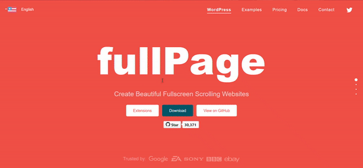

# JSON AND JAVASCRIPT LIBRARIES

- [JSON](#json)
- [JavaScript Libraries](#javascript-libraries)
    - [What are JavaScript Libraries?](#what-is-javascript-libraries)
    - [How to Use JavaScript Libraries](#how-to-use-javascript-libraries)
    - [Uses of JavaScript Libraries](#uses-of-javascript-libraries)
    - [Most popular JavaScript libraries](#below-is-a-list-of-some-of-the-most-popular-JavaScript-libraries)
    - [jQuery](#jQuery)
    - [React.js](#react-js)
    - [D3.js](#d3.js)
    - [Chart.js](#chart.js)
    - [Underscore.js](#underscore.js)
    - [Lodash](#lodash)  
    - [ Few awsome javascript libraries](#few-awsome-javascript-libraries-that-you-can-try-out-by-yourself)  
    - [Chart.js](#chart.js)
    - [Underscore.js](#underscore.js)
    - [Lodash](#lodash)   
 <hr>
 
## JSON  

JSON stands for JavaScript Object Notation

The JSON syntax is derived from JavaScript object notation syntax, but the JSON format is text only. Code for reading and generating JSON data can be written in any programming language.
 
 **SYNTAX**
 
 ```js
 {
    "key":"value",
    "key":"value",
    "key":"value",
}
```

 **Example:**

```js
{

"users":[
  {
    "firstName":"Shreya",
    "lastName":"Jaiswal",
    "age":21,
    "email":"shreya@gmail.com"
  },
  {
    "firstName":"Bitto",
    "lastName":"Aggarwal",
    "age":25,
    "email":"bitto@gmail.com"
  },
  {
  "firstName":"Piyush",
  "lastName":"Nagpal",
  "age":22,
  "email":"piyush@gmail.com"
  }
]
}
```
<hr>

### Convert JSON String to JavaScript Object

The JSON module offers two methods - stringify(), which turns a JavaScript object into a JSON String, and parse(), which parses a JSON string and returns a JavaScript object.

JSON text/object can be converted into Javascript object using the function JSON.parse().

**SYNTAX**

```js
const jsonString = '{"name" : "shreya", "city" : "kolkata", "age" : "21"}';
const student = JSON.parse(jsonString);
console.log('Type: ', typeof student);
console.log('Contents: ', student)
```
**EXAMPLE**

```js
<html>
<body>

<h2>Converting JSON Text into Javascript Object</h2>
<b>JSON Object :</b>
<p id="demo"></p>
<b>Use of Javascript object :</b>
<p id="demo1"></p>

<script>
var jsonobj ='{ "name":"Shreya","designerof":"Javascript","bornin":"2001" }';

// Here we convert JSON to object
var obj = JSON.parse(jsonobj);

document.getElementById("demo1").innerHTML =
					obj.name + ", who was born in "
					+ obj.bornin + ", was the designer of "
					+ obj.designerof;
document.getElementById("demo").innerHTML =jsonobj;
</script>
</body>
</html>
```

**OUTPUT**


## JavaScript JSON stringify() Method

Javascript's JSON.stringify() technique is used to convert it into a JSON string. It is frequently necessary to serialise data to strings while creating a JavaScript application in order to store it in a database, send it to an API, or send it to a web server.

**SYNTAX**

```js
JSON.stringify(value, replacer, space);
```

**EXAMPLE**

```js
<script>
	const value = {
		Company: "Geekster",
		Estd: 2020,
		location: "Gurugram"
	};
	const result = JSON.stringify(value);
	document.write("value of result = " + result + "<br>");
</script>
```

**OUTPUT**


## Exercise

1. Make a json file for each employee with the following information: name, department, designation, salary, and raise.

   Shreya,Tech,devloper,90000,true
  
   Mayank,finance,Trainee,50000,true
  
   shruti,HR,Manager,40000,false

2. Create a json for the company with the folowing details
   company-name,website,employees 

    Geekster, www.geekster.com , arrary of employes

3. A new employee has joined the company. Update the json of the company.
   Prithvi,HR,Manager,30000,True

4. Given the JSON for the company, calculate the total salary bill for the company.

<hr>

## JavaScript Libraries

- [What are JavaScript Libraries?](#what-is-javascript-libraries)
- [How to Use JavaScript Libraries](#how-to-use-javascript-libraries)
- [Uses of JavaScript Libraries](#uses-of-javascript-libraries)
- [Most popular JavaScript libraries](#below-is-a-list-of-some-of-the-most-popular-JavaScript-libraries)
    - [jQuery](#jQuery)
    - [React.js](#react-js)
    - [D3.js]()
    - [Chart.js]()
    - [Underscore.js]()
    - [Lodash]()

<hr>

## What are JavaScript Libraries?
 
Java Script Libraries are a new application designed to enhance HTML web pages with dynamic features. The features include navigation, forms, and dynamic content presentation. The JavaScript libraries are written in the Java programming language and are called “Java Script Libraries” because most of the JavaScript programs are written using the Netscape JavaScript Programming Guide. Java Script Libraries can be used to provide features such as dynamic forms.

<hr>

## How to Use JavaScript Libraries
To use a JavaScript library in your app, add <script> to the <head> element using the src attribute that references the library source path or the URL.

Read the JavaScript library’s documentation you intend to use for more information and follow the steps provided there.
  
  <hr>
  
## Uses of JavaScript Libraries
  
 - Data Visualization in Maps and Charts
 - DOM Manipulation
 - Data Handling
 - Effective database management
 - Image Effects
 - User Interface and Its Components
 - Animations and Forms
  
  <hr>
  
  ## Below is a list of some of the most popular JavaScript libraries.
  
 # 1. jQuery
  
  jQuery is a JavaScript library for Document Object Model (DOM) manipulation. It is lightweight, cross-browser, and feature-rich. It provides a wide variety of techniques that can be used to manipulate HTML and CSS. In addition, it supports many common event-handling techniques such as key, mouse, focus and blur functions, and Ajax calls.
  
  ## Key points
  
  - It uses CSS3 selectors in manipulating style properties and finding elements.
  - Includes minimalistic API, which is easy to use.
  - Supports an AMD module and is lightweight
  - It is easy for beginners as its syntax is similar to CSS.
  
  <hr>
  
  # 2. React Js
  
  React is a JavaScript library that makes it easy to build user interfaces. React takes a declarative approach to building components that can update and animate on their own as a game engine does. A component is built via JavaScript, then rendered to the page. In addition, a component is reusable in that it can be put into another component (like a panel button), and it can be accessed from anywhere on the page (like a button).
  
  ## Key Points

 - It uses lifecycle methods like render and component DidMount. It allows code execution at specific points during an entity’s lifetime.
 - It supports JavaScript XML (JSX) that combines both JS and HTML.
 - By creating an in-memory cache in a data structure, it uses a virtual DOM.
  
  <hr>
  
  ## 3. D3.js
  
  D3 stands for Data-driven documents. Developers use it for the manipulation of documents based on the data. It was released in the year 2011 under the BSD license.
  
  ## Key Points

 - Supports HTML, CSS, and SVG
 - Has a data-driven approach, manipulates the DOM
 - Allow more comprehensive graphical complexity within high frame rates by reducing overheads
 - Supports a vast number of dynamic behavior and datasets for animations and interaction.
  
 <hr>
  
  ## 4. Chart.js
  
  Chart.js is a flexible and simple library for designers and developers who can add beautiful charts and graphs to their projects in no time. It is open-source and has an MIT license.
  
  ## Key Features
  
  - Elegant and simple to add basic charts and graphs.
  - Results in responsive web pages.
  - Lightweight to load and easy to learn and implement.
  - 8 different types of charts.
  - Great for beginners.
  - Animation capabilities to make pages more interactive.
  - Provide clear visual representations when different datasets are used with the help of mixed chart types.
  - Plot sparse and complex datasets on logarithmic, date, time, or custom scales.
  
  <hr>
  
  ## 5 Underscore.js
  
  Underscore is a JavaScript utility library that provides various functions for typical programming tasks. Jeremy Askenas created it in 2009, released by MIT license. Underscore is a utility-belt library of JavaScript functions. It is a lot like the native JavaScript library, but with one significant difference: it is optimized for javascript on the server, not on the browser. It is not a complete library like jQuery but a set of practical, standard functions either in the jQuery repository or plain javascript. It has functions for Array, Object, String, Math, Date, RegExp, and a few more.
  
  ## Key points

  - has a functional programming design rather than object prototype extensions.
  - It has 100+ functions of 4 different types. The functions to manipulate are:
     - objects
     - arrays
     - both object and arrays
     - other functions.
  
  <hr>
  
  ## 6. Lodash
  
  Lodash is a javascript utility library. It’s often used for functional programming but is a pretty helpful general-purpose utility library – it’s sort of like Underscore.js but just a lot more. It’s a complete utility library for modern JavaScript developers with over 100 different functions included and a few utility functions and data structure helpers. It’s all built on Underscore, so it’s a drop-in replacement with more parts.
  
  ## Key points

  - Helps you write concise JavaScript codes.
  - Simplifies common tasks like debouncing, binding, throttling, math operations, etc.
  - It makes trimming, camel case and uppercase tasks simple
  
  <hr>
  
# Few awsome javascript libraries that you can try out by yourself.
	
## 1. fullPage.js

FullPage.js, an open-source JS toolkit, makes it simple to build one-page or full-screen scrolling webpages. In addition to adding a landscape slider inside your site sections, it is easy to use.

  ## Key points

- Offers a wide range of customization and configuration options.
- Supports JavaScript frameworks like react-fullpage, angular-fullpage, and vue-fullpage.
- Enables both vertical and horizontal scrolling.
- Responsive design that fits the screens of different sizes as well as multiple browsers.
- Auto-scrolling on page loads.
- Video/image lazy load.
	
Click here to learn more about the library [Click me👆](https://alvarotrigo.com/react-fullpage/#page1)
	


 <hr>

## 2. Particle.js

A lot of tiny particles moving around and interacting with each other—or with you—have a certain appeal to them. If you are ever in a situation where you need to work with a lot of particles, Particles.js will serve you well. As is evident from the name, it is a JavaScript library that can help you create particle systems.
	
 ## Key points
	
- it is lightweight, easy to use, and gives you a lot of control. 

Click here to learn more about the library [Click me👆](https://github.com/VincentGarreau/particles.js/)
	


<hr>
	
## 3. simpleParallax.js 

simpleParallax.js is a very simple and tiny Vanilla JS library that adds parallax animations on any images.


Click here to learn more about the library [Click me👆](https://simpleparallax.com/)
	

	
<hr>

	
