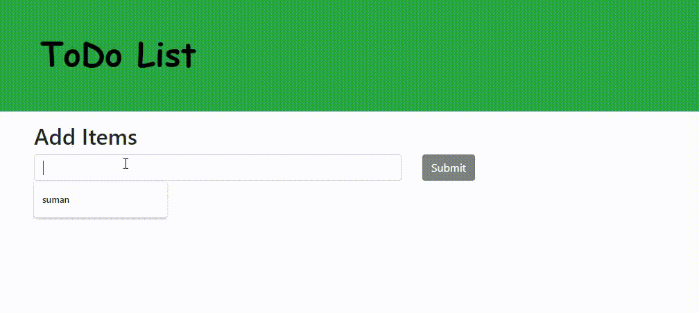

# Create To-do List using Vanilla JavaScript

Good day, geeks!👋

If you completed the prior little project, congratulations! You are doing fantastically.

You are becoming better every day, so let's explore how to make a to-do list. Its a simple project to make your concepts strong.
After making this project What you'll Learn :-

 - DOM Manipulation
 - Classlist
 - ChildNodes
 - Forms

 So go ahead and attempt this mini project.

## what is to-do list

The lists we typically use to keep track of our daily chores—or a list of everything we need to do—have the most crucial things at the top and the least crucial tasks at the bottom. 
We can use it to plan our everyday schedules. We are always free to add new assignments and remove ones that have been completed. 

A TODO list can be used to complete the following four main tasks:

- Add tasks
- Update tasks
- Read tasks
- Delete tasks

1. Create To-do List using Vanilla JavaScript

