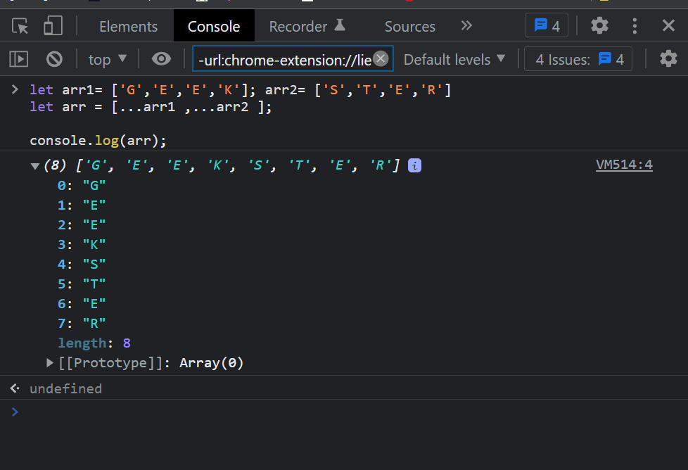
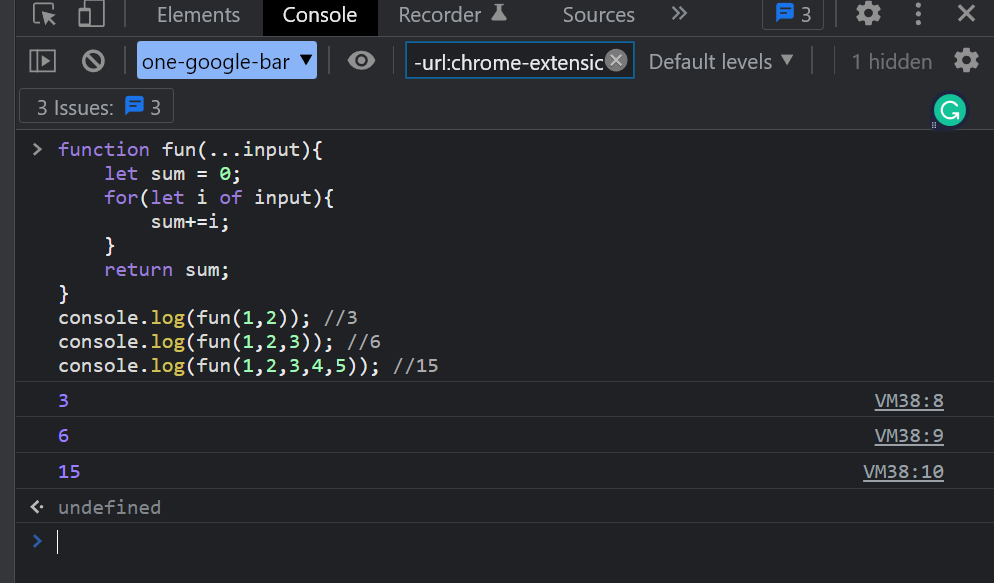
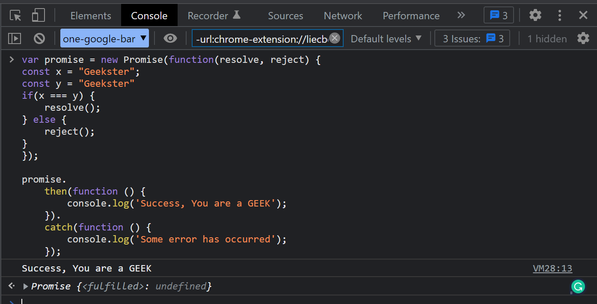
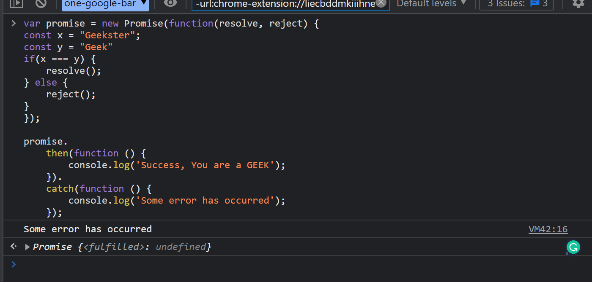
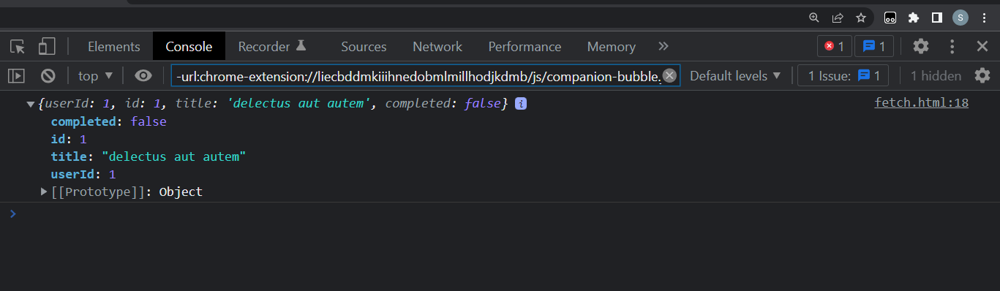

# Learn ES6 concepts with Geekster

- [Introduction to the ES6 course](#Introduction-to-the-ES6-course)
- [Template Literals](#Template-Literals)
- [Destructuring objects](Destructuring-objects)
- [Destructuring Arrays](#Destructuring-Arrays)
- [Spread Operator](#Spread-Operator)
- [Rest Operator](#Rest-Operator)
- [Arrow Functions](#Arrow-Functions)
- [Let & Const](#Let-&-Const)
- [Promises](#Promises)
- [Introduction: Fetch](#Introduction-Fetch)
- [Async & Await](#Async-&-Await)
- [Exercises](#exercises)

<hr>

## Introduction to the ES6 course

The sixth iteration of the ECMAScript programming language is known as ES6 or ECMAScript 2015. The standardisation of Javascript, known as ECMAScript, was made available in 2015 and given the new name ECMAScript 2015.
Both ECMAScript and Javascript have different natures.

Since Javascript ES6 has been around for a while, we can write code in a clever style that essentially makes the code more current and easier to read. With the use of ES6 capabilities, it's reasonable to state that we write less and accomplish more, therefore the phrase "write less, do more" absolutely applies to ES6.

Const, let, arrow functions, template literals, default parameters, and many other important features were introduced in ES6.

<hr>

## Template Literals

In ES6, Template Literal offers new features that allow you to generate a string with more control over dynamic strings. String is typically created with either single (') or double (") quotes. The backtick (') is used to produce the template literal.

**SYNTAX**

```js
var s=`Geekster`;
```

**EXAMPLE**

```js
<script>
var s=String.raw`Welcome to Geekster Value of expression is ${2*3}`;
document.write(s);
</script>
```

**OUTPUT**

```js
Welcome to Geekster Value of expression is 6
```

<hr>

## Destructuring objects

A JavaScript statement called "Destructuring Assignment" enables the unpacking of array contents or object properties into separate variables. Data can be taken out of arrays, objects, nested objects, and variable assignments. The left-hand side of the Destructuring Assignment defined which value should be unpacked from the supplied variable.

**SYNTAX**

```js
({ x, y} = { x: 10, y: 20 });
console.log(x); // 10
console.log(y); // 20
```

**EXAMPLE**

```js
<script>
var age= {x: 21, y: -34, z: 47 };
const { x, y, z } = age; // x = 21, y = -34, z = 47
console.log(x);
console.log(y);
console.log(z);
</script>
```

**OUTPUT**

```js
21
-34
47
```

<hr>

## Destructuring Arrays

**SYNTAX**

```js
({ x, y} = { x: 10, y: 20 });
console.log(x); // 10
console.log(y); // 20
```

**EXAMPLE**

```js
<script>
var names = ["Geek1", "Geek2", "Geek3", "Geek4"];

var firstName = names[3];
var secondName = names[2];

console.log(firstName);
console.log(secondName);
</script>
```

**OUTPUT**

```js
Geek4
Geek3
```

<hr>

## Spread Operator

An iterable can extend using the spread operator in areas where 0+ arguments are anticipated. It is typically used in variable arrays where more than one value is anticipated. We have the right to get a list of parameters from an array thanks to it. Spread operator's syntax is identical to that of the Rest parameter, but it functions completely differently.

**SYNTAX**

```js
var variablename1 = [...value]; 
```

**EXAMPLE**

```js
let arr1 = ['G','E','E','K'];
let arr2 = ['S','T','E','R'];
let arr=[...arr1,...arr2]   
console.log(arr);
```

**OUTPUT**



<hr>

## Rest Operator

The rest parameter is a better technique to handle function parameters since it makes it simpler to handle different inputs as function parameters. We can specify an infinite number of arguments as an array using the remainder parameter syntax. No matter how a function was defined, it can be called with any amount of parameters by using the remainder parameter. The addition of the rest parameter in ES2015 or ES6 improves the ability to handle parameters.

**SYNTAX**

```js
function functionname(...parameters)   //... is the rest parameter (triple dots)
{
statement;
}
```

**EXAMPLE**

```js
function fun(...input){
    let sum = 0;
    for(let i of input){
        sum+=i;
    }
    return sum;
}
console.log(fun(1,2)); //3
console.log(fun(1,2,3)); //6
console.log(fun(1,2,3,4,5)); //15
```

**OUTPUT**



<hr>

## Arrow Functions

The fundamental building block of any programming language is function, which is used to create and combine related pieces of code. Every programming language offers a specific set of guidelines for writing any function. One of the most popular and effective syntaxes for writing a function in JavaScript is the arrow function.

**SYNTAX**

```js
const myFunction = (param1, param2,
    .... paramN) => { // function code }
const myFunction = (param) => { // function code }
                      or 
const myFunction = param => { // function code }  
const myFunction = param => { return param*param }
                      or 
const myFunction = param => param*param
```

**EXAMPLE**

```js
<script>
const myFunction = () =>{
  let a = 5, b = 4;
  return a+b;
}
console.log(myFunction());
</script>
```

**OUTPUT**

```js
9
```

<hr>

## Let & Const

In JavaScript, the let keyword is used to declare variables that are to be made as block-scoped, i.e., it allows us to declare a variable within a block or within an expression rather than in the entire document. Let variables cannot be accessed outside of the block-scope that has been set up for them.

**SYNTAX**

```js
let variable_name = value;
const x = 12;
```

**EXAMPLE**

```js
let name = "Geekster";
const x = 12;
```
Key difference: The variable declared by let keyword can be reassigned whereas a variable declared with const keyword can never be reassigned within the same scope.

<hr>

## Promises

In JavaScript, asynchronous operations are managed through promises. When dealing with several asynchronous activities, where callbacks might lead to callback hell and incomprehensible code, they are simple to manage.

The callback hell that would result from having several callback functions would make the code unmanageable. Additionally, managing several callbacks at once is difficult for any user.
Events had difficulty handling asynchronous tasks.

For handling asynchronous actions in the simplest way possible, promises are the best option. In comparison to callbacks and events, they can manage many asynchronous activities with ease and offer better error handling. In other words, promises are the best option for managing several callbacks concurrently, preventing the undesirable callback hell scenario. Promises do give users a greater chance to interpret code more effectively and efficiently, especially when such code is being utilized to implement several asynchronous actions.

**Four states make up a promise**

fulfilled: successful promise-related action.
rejected: A promise-related action failed 
pending: Promise has not yet been fulfilled
settled: Promise has fulfilled or rejected

**SYNTAX**

```js
var promise = new Promise(function(resolve, reject){
     //do something
});
```

**EXAMPLE**

```js
var promise = new Promise(function(resolve, reject) {
const x = "Geekster";
const y = "Geekster"
if(x === y) {
	resolve();
} else {
	reject();
}
});

promise.
	then(function () {
		console.log('Success, You are a GEEK');
	}).
	catch(function () {
		console.log('Some error has occurred');
	});
```

**OUTPUT**

Upon fulfilling a promise



After Rejecting promise



<hr>

## Introduction: Fetch

JavaScript's get() method is used to make requests to the server and load data onto webpages. Any API that returns data in the JSON or XML format can be requested. A promise is returned by this procedure.

**SYNTAX**

```js
vfetch('url')           //api for the get request
  .then(response => response.json())
  .then(data => console.log(data));
```
The two parameters that this method accepts are as follows and are specified above:

URL: This is the URL that the request should be sent to.

Options: The set of properties is an array. It is a choice-based parameter.

Return Value: Whether it is resolved or not, it returns a promise. The returned information may be in the XML or JSON formats. It could be a collection of objects or just one object.


**EXAMPLE**

```html
<!DOCTYPE html>
<html lang="en">
<head>
    <meta charset="UTF-8">
    <meta name="viewport"
        content="width=device-width, initial-scale=1.0">
    <title>JavaScript | fetch() Method</title>
</head>
<body>
    <script>
        // API for get requests
        let fetchRes = fetch(
"https://jsonplaceholder.typicode.com/todos/1");
        // fetchRes is the promise to resolve
        // it by using.then() method
        fetchRes.then(res =>
            res.json()).then(d => {
                console.log(d)
            })
    </script>
</body>
</html>
```

**OUTPUT**



<hr>

## Async & Await

Async: It simply enables us to write promises-based code in the same manner as synchronous code while also ensuring that we don't interfere with the thread of execution. It uses the event-loop to run asynchronously. A value is always returned by async functions. It guarantees that promises be fulfilled, and if they are not, JavaScript automatically wraps them in promises that are resolved with their values.

**SYNTAX**

```js
const getData = async() => {
    var data = "Hello Geeks";
    return data;
} 
getData().then(data => console.log(data));
```

**OUTPUT**

```js
Hello Geeks
```

Await: To wait for the promise, use the await function. It could only be applied to the async block. It instructs the code to wait until the promise responds. It merely delays the async block.

**SYNTAX**

```js
const getData = async() => {
    var y = await "Hello Geeks";
    console.log(y);
}
 
console.log(1);
getData();
console.log(2);
```
**OUTPUT**

```js
1
2
Hello Geeks
```

<hr>

## Exercises

### Exercises: Level 1

```js
const constants = [2.72, 3.14, 9.81, 37, 100]
const countries = ['Finland', 'Estonia', 'Sweden', 'Denmark', 'Norway']
const rectangle = {
  width: 20,
  height: 10,
  area: 200,
  perimeter: 60
}
const users = [
{
  name:'Brook',
  scores:75,
  skills:['HTM', 'CSS', 'JS'],
  age:16
},
{
  name:'Alex',
  scores:80,
  skills:['HTM', 'CSS', 'JS'],
  age:18
},
{
  name:'David',
  scores:75,
  skills:['HTM', 'CSS'],
  age:22
},
{
  name:'John',
  scores:85,
  skills:['HTML'],
  age:25
},
{
  name:'Sara',
  scores:95,
  skills:['HTM', 'CSS', 'JS'],
  age: 26
},
{
  name:'Martha',
  scores:80,
  skills:['HTM', 'CSS', 'JS'],
  age:18
},
{
  name:'Thomas',
  scores:90,
  skills:['HTM', 'CSS', 'JS'],
  age:20
}
]
```

1. Destructure and assign the elements of constants array to e, pi, gravity, humanBodyTemp, waterBoilingTemp.
2. Destructure and assign the elements of countries array to fin, est, sw, den, nor
3. Destructure the rectangle object by its properties or keys.

### Exercises: Level 2

1. Iterate through the users array and get all the keys of the object using destructuring
2. Find the persons who have less than two skills

### Exercises: Level 3

1. Destructure the countries object print name, capital, population and languages of all countries
2. A junior developer structure student name, skills and score in array of arrays which may not easy to read. Destructure the following array name to name, skills array to skills, scores array to scores, JavaScript score to jsScore and React score to reactScore variable in one line.

  ```js
    const student = ['David', ['HTM', 'CSS', 'JS', 'React'], [98, 85, 90, 95]]
    console.log(name, skills, jsScore, reactScore)
  ```

  ```sh
  David (4) ["HTM", "CSS", "JS", "React"] 90 95
  ```

3. Write a function called *convertArrayToObject* which can convert the array to a structure object.

  ```js
      const students = [
          ['David', ['HTM', 'CSS', 'JS', 'React'], [98, 85, 90, 95]],
          ['John', ['HTM', 'CSS', 'JS', 'React'], [85, 80, 85, 80]]
        ]

      console.log(convertArrayToObject(students))
      [
        {
          name: 'David',
          skills: ['HTM','CSS','JS','React'],
          scores: [98,85,90,95]
        },
        {
          name: 'John',
          skills: ['HTM','CSS','JS','React'],
          scores: [85, 80,85,80]
        }
      ]
```

### Exercises: Level 4 (promises)

```js
const countriesAPI = 'https://restcountries.com/v2/all'
const catsAPI = 'https://api.thecatapi.com/v1/breeds'
```

### Exercises: Level 4-1

1. Read the countries API using fetch and print the name of country, capital, languages, population and area.

### Exercises: Level 4-2

1. Print out all the cat names in to catNames variable.

### Exercises: Level 4-3

1. Read the cats api and find the average weight of cat in metric unit.
2. Read the countries api and find out the 10 largest countries
3. Read the countries api and count total number of languages in the world used as officials.


