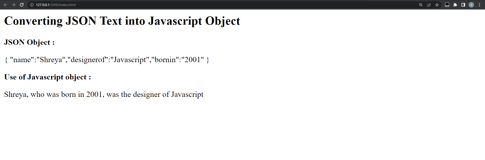

# JSON  


JSON stands for JavaScript Object Notation

 The JSON syntax is derived from JavaScript object notation syntax, but the JSON format is text only. Code for reading and generating JSON data can be written in any programming language.
 
 **SYNTAX**
 
 ```js
 {
    "key":"value",
    "key":"value",
    "key":"value",
}
```

 **Example:**

```js
{

"users":[
  {
    "firstName":"Shreya",
    "lastName":"Jaiswal",
    "age":21,
    "email":"shreya@gmail.com"
  },
  {
    "firstName":"Bitto",
    "lastName":"Aggarwal",
    "age":25,
    "email":"bitto@gmail.com"
  },
  {
  "firstName":"Piyush",
  "lastName":"Nagpal",
  "age":22,
  "email":"piyush@gmail.com"
  }
]
}
```
<hr>

### Convert JSON String to JavaScript Object

The JSON module offers two methods - stringify(), which turns a JavaScript object into a JSON String, and parse(), which parses a JSON string and returns a JavaScript object.

JSON text/object can be converted into Javascript object using the function JSON.parse().

**SYNTAX**

```js
const jsonString = '{"name" : "shreya", "city" : "kolkata", "age" : "21"}';
const student = JSON.parse(jsonString);
console.log('Type: ', typeof student);
console.log('Contents: ', student)
```
**EXAMPLE**

```js
<html>
<body>

<h2>Converting JSON Text into Javascript Object</h2>
<b>JSON Object :</b>
<p id="demo"></p>
<b>Use of Javascript object :</b>
<p id="demo1"></p>

<script>
var jsonobj ='{ "name":"Shreya","designerof":"Javascript","bornin":"2001" }';

// Here we convert JSON to object
var obj = JSON.parse(jsonobj);

document.getElementById("demo1").innerHTML =
					obj.name + ", who was born in "
					+ obj.bornin + ", was the designer of "
					+ obj.designerof;
document.getElementById("demo").innerHTML =jsonobj;
</script>
</body>
</html>
```

**OUTPUT**



## JavaScript JSON stringify() Method

Javascript's JSON.stringify() technique is used to convert it into a JSON string. It is frequently necessary to serialise data to strings while creating a JavaScript application in order to store it in a database, send it to an API, or send it to a web server.

**SYNTAX**

```js
JSON.stringify(value, replacer, space);
```

**EXAMPLE**

```js
<script>
	const value = {
		Company: "Geekster",
		Estd: 2020,
		location: "Gurugram"
	};
	const result = JSON.stringify(value);
	document.write("value of result = " + result + "<br>");
</script>
```

**OUTPUT**


## Exercise

1. Make a json file for each employee with the following information: name, department, designation, salary, and raise.

   Shreya,Tech,devloper,90000,true
  
   Mayank,finance,Trainee,50000,true
  
   shruti,HR,Manager,40000,false

2. Create a json for the company with the folowing details
   company-name,website,employees 

    Geekster, www.geekster.com , arrary of employes

3. A new employee has joined the company. Update the json of the company.
   Prithvi,HR,Manager,30000,True

4. Given the JSON for the company, calculate the total salary bill for the company.

<!-- 5. Given salaries of employees have to be revised. for an employee, if the raise is true, the salary is increased by 10%. Given the JSON for the company update the salary for each employee and set the raise to false after updating. -->


