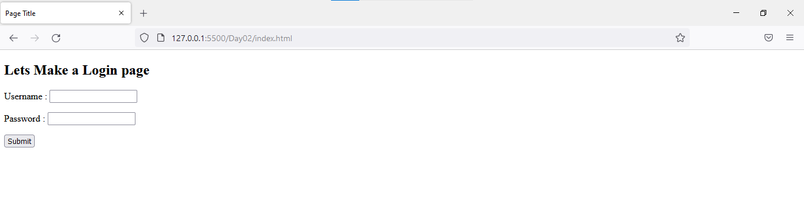
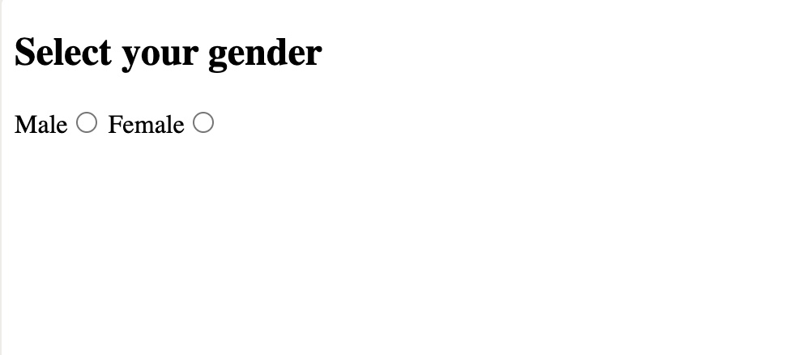
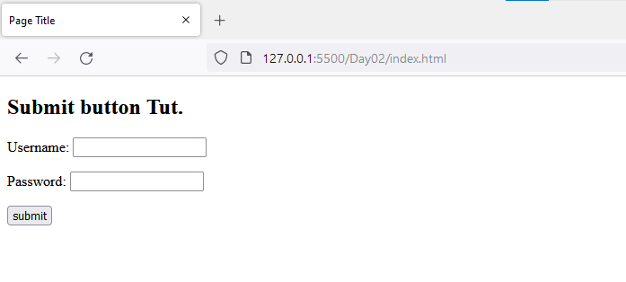
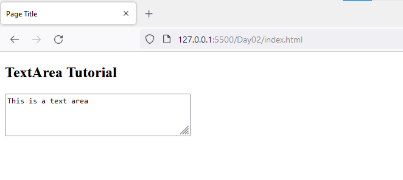

- [The `<form>` Element](#the-form-element)
- [Form elements](#form-elements)
- [Textbox in HTML Form](#textbox-in-html-form)
- [Password in an HTML Form](#password-in-an-html-form)
- [Radio Button in an HTML Form](#radio-button-in-an-html-form)
- [Checkbox in an HTML Form](#checkbox-in-an-html-form)
- [Combobox in an HTML Form](#combobox-in-an-html-form)
- [Submit button in an HTML Form](#submit-button-in-an-html-form)
- [TextArea in an HTML Form](#textarea-in-an-html-form)
- [Create an HTML form to input the basic details of a student](#create-an-html-form-to-input-the-basic-details-of-a-student)
- [TO-DO](#to-do)
# The `<form>` Element

All forms start with a ``<form>`` element, like this:

```html
<form action="/my-handling-form-page" method="post">

</form>
```
This element formally defines a form. It's a container element like a ``<section>`` or ``<footer>`` element, but specifically for containing forms; it also supports some specific attributes to configure the way the form behaves. All of its attributes are optional, but it's standard practice to always set at least the action and method attributes:

1. The ``action`` attribute defines the location (URL) where the form's collected data should be sent when it is submitted.
2. The ``method`` attribute defines which HTTP method to send the data with (usually get or post).

# Form elements
These are the following HTML ``<form>`` elements:

1. ``<label>``: It defines label for ``<form>`` elements.

2. ``<input>``: It is used to get input data from the form in various types such as text, password, email, etc by changing its type.
3. ``<button>``: It defines a clickable button to control other elements or execute a functionality.
4. ``<select>``: It is used to create a drop-down list.
5. ``<textarea>``: It is used to get input long text content.
6. ``<fieldset>``: It is used to draw a box around other form elements and group the related data.
7. ``<option>``: It is used to define options in a drop-down list.

# Textbox in HTML Form
In an HTML form, we use the ``<input>`` tag by assigning type attribute value to text to input single line input. To define type attribute see the below syntax. 

Tip: The default value of the type attribute is “text”.

```html
Syntax:

<input type="text" />
```

Or shorthand for “text” type:
```html
<input />
```

# Password in an HTML Form
We can change type value text to password to get the input password 

Example:

```html
<!DOCTYPE html>
<html>
<head>
<title>Page Title</title>
</head>
<body>
<h2>Lets Make a Login page</h2>
<form>
<p>
	<label>Username : <input type="text" /></label>
</p>
<p>
	<label>Password : <input type="password" /></label>
</p>
<p>
	<button type="submit">Submit</button>
</p>
</form>
</body>
</html>
```

**Output:**



In the above example, we can see the difference between type text and type password. The username will be visible but the password will not be visible. 

# Radio Button in an HTML Form
To create a radio button, we use the ``<input>`` tag following by radio type to provide users to choose a limited number of choices.

 Syntax:
```html
<input type="radio" name="radio_button_name" value="radio_button_value" />
```

**Note:** The radio button must have shared the same name to be treated as a group. 

**Note:** The value attribute defines the unique value associated with each radio button. The value is not shown to the user, but is the value that is sent to the server on “submit” to identify which radio button that was selected.

**Example:**

In this example, we will create a radio button to choose your gender. 

```html
<!DOCTYPE html>
<html>
<head>
<title>Page Title</title>
</head>
<body>
<h2>Select your gender</h2>
<form>
	<label>Male<input type="radio" name="gender" value="male" /></label>
	<label>Female<input type="radio" name="gender" value="female" /></label>
</form>
</body>
</html>

```


**Output:**



# Checkbox in an HTML Form
To create a checkbox in an HTML form, we use the ``<input>`` tag followed by the input type checkbox. It is a square box to tick to activate this. It used to choose more options at a time. 

Syntax:
```html
<input type="checkbox" name="select_box_name" value="select_box_value" />
```

**Note:** the “name” and “value” attributes are used to send the checkbox data to the server.

**Example:**

In this example, we use checkboxes to select language. 

```html
<!DOCTYPE html>
<html>
<head>
<title>Page Title</title>
</head>
<body>
<h2>Choose Language</h2>
<form>
	<ul style="list-style-type:none;">
	<li><input type="checkbox" name="language" value="hindi" />Hindi</li>
	<li><input type="checkbox" name="language" value="english" />English</li>
	<li><input type="checkbox" name="language" value="sanskrite" />Sanskrit</li>
	</ul>
</form>
</body>
</html>
```

**Output:**


# Combobox in an HTML Form
Combobox is used to create a drop-down menu in your form which contains multiple options. So, to create an Combobox in an HTML form, we use the ``<select>`` tag with ``<option>`` tag. It is also known as a drop-down menu. 

Syntax:

```html
<select name="select_box_name">
  <option value="value1">option1</option>
  <option value="value2">option2</option>
  <option value="value3">option3</option>
</select>
```

**Note:** the “name” and “value” attributes are used to send the Combobox data to the server.

**Example:**

In this example, we will create a dropdown menu to select Nationality. 

```html
<!DOCTYPE html>
<html>
<head>
<title>Page Title</title>
</head>
<body>
<h2>Select Your Nationality</h2>
<form>
<select name="language">
	<option value="indian">Indian</option>
	<option value="nepali">Nepali</option>
	<option value="others">Others</option>
</select>
</form>
</body>
</html>
```

**Output:**


# Submit button in an HTML Form
In the HTML form, submit button is used to submit the details of the form to the form handler. A form handler is a file on the server with a script that is used to process input data.  

Syntax:
```html
 <button type="submit">submit</button>
 ```

 ```html
 <!DOCTYPE html>
<html>
<head>
<title>Page Title</title>
</head>
<body>

<h2>Submit button Tut.</h2>

<form>

<p>
	<label>Username: <input type="text" /></label>
<p>
	<label>Password: <input type="password" /></label>
</p>
<p>
	<button type="submit">submit</button>
</p>

</form>
</body>
</html>
```

**Output:**




# TextArea in an HTML Form

In the HTML form, a text area is used to add comments or reviews, or addresses to the form, in other words, the text area is a multi-line text input control. It contains an unlimited number of characters, the text renders in a fixed-width font, and the size of the text area is given by the ``<rows>`` and ``<cols>`` attributes. To create a text area in the form use the ``<textarea>`` tag.

Syntax:
```html
<textarea name="textarea_name">content</textarea>
```

**Note:** the name attribute is used to reference the textarea data after it is send to a server.

Example:

```html
<!DOCTYPE html>
<html>
<head>
<title>Page Title</title>
</head>
<body>
<h2>TextArea Tutorial</h2>
<form>
	<textarea name="welcomeMessage" rows="3" cols="40">This is a text area</textarea>
</form>
</body>
</html>
```

**Output:**



# Create an HTML form to input the basic details of a student
In this example, we will take input such as Salutation, First Name, Last Name, Email, Phone, Gender, Date of Birth, and Address. 

To create this form, we need to use the ``<legend> ``tag to defined caption, ``<select>`` tag for Salutation, ``<option>`` tag to define elements of Salutation, ``<input>`` tag for First Name, Last Name, Email, Phone, Date of Birth by changing ``<input>`` tag type attribute, ``<textarea>`` to input address, radio button for gender. After defining all these stuffs, we will use a ``<button>`` to submit this form data. 

```html
<!DOCTYPE html>
<html lang="en">
<head>
<meta charset="UTF-8">
<meta http-equiv="X-UA-Compatible" content="IE=edge">
<meta name="viewport" content="width=device-width, initial-scale=1.0">
<title>Form</title>
</head>
<body>
<form>
	<fieldset>
	<legend>Personal Details</legend>

<p>
		<label>
		Salutation
		<br />
		<select name="salutation">
			<option>--None--</option>
			<option>Mr.</option>
			<option>Ms.</option>
			<option>Mrs.</option>
			<option>Dr.</option>
			<option>Prof.</option>
		</select>
		</label>
	</p>

<p>
		<label>First name: <input name="firstName" /></label>
	</p>

<p>
		<label>Last name: <input name="lastName" /></label>
	</p>

<p>
		Gender :
		<label><input type="radio" name="gender" value="male" /> Male</label>
		<label><input type="radio" name="gender" value="female" /> Female</label>
	</p>


<p>
		<label>Email:<input type="email" name="email" /></label>
	</p>

<p>
		<label>Date of Birth:<input type="date" name="birthDate"></label>
	</p>

<p>
		<label>
		Address :
		<br />
		<textarea name="address" cols="30" rows="3"></textarea>
		</label>
	</p>

<p>
		<button type="submit">Submit</button>
    </p>
	</fieldset>
</form>
</body>
</html>
```

**Output:**


# TO-DO
[Learn HTML by Building a cat photo app](https://www.freecodecamp.org/learn/2022/responsive-web-design/#learn-html-by-building-a-cat-photo-app)