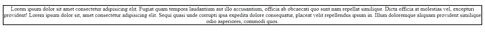
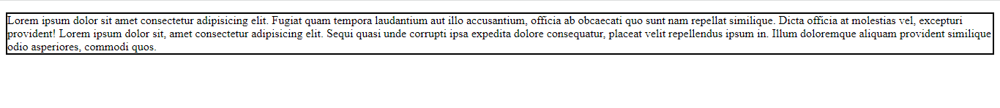
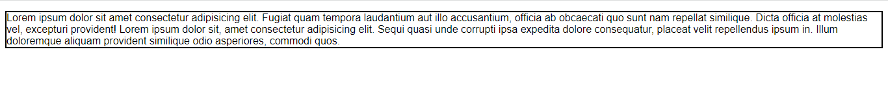
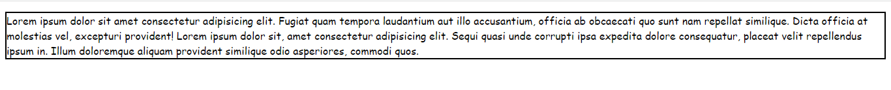

- [Text alignment](#text-alignment)
    - [Syntax](#syntax)
    - [Examples](#examples)
- [CSS Properties](#css-properties)
- [Font families](#font-families)
- [Web safe fonts](#web-safe-fonts)
- [Default fonts](#default-fonts)
- [Font stacks](#font-stacks)
- [position](#position)
- [values](#values)
    - [static](#static)
    - [relative](#relative)
    - [absolute](#absolute)
    - [fixed](#fixed)
    - [sticky](#sticky)
- [TO-DO](#to-do)
- [Resources for TO-DO](#resources-for-to-do)

# Text alignment
The `text-align` property is used to control how text is aligned within its containing content box. The available values are listed below. They work in pretty much the same way as they do in a regular word processor application:

**start**
The same as left if direction is left-to-right and right if direction is right-to-left.

**end**
The same as right if direction is left-to-right and left if direction is right-to-left.

**left**
The inline contents are aligned to the left edge of the line box.

**right**
The inline contents are aligned to the right edge of the line box.

**center**
The inline contents are centered within the line box.

**justify**
The inline contents are justified. Text should be spaced to line up its left and right edges to the left and right edges of the line box, except for the last line.

**justify-all Experimental**
Same as justify, but also forces the last line to be justified.

## Syntax:

```css
/* Keyword values */
text-align: start;
text-align: end;
text-align: left;
text-align: right;
text-align: center;
text-align: justify;
```

## Examples :

```html
<!DOCTYPE html>
<html lang="en">
<head>
    <meta charset="UTF-8">
    <meta http-equiv="X-UA-Compatible" content="IE=edge">
    <meta name="viewport" content="width=device-width, initial-scale=1.0">
    <title>Document</title>
    <style>
        #start{
            /* text-align: end;
            text-align: center; */
            border: 2px solid black;
        }
    </style>
</head>
<body>
    <p id="start">
        Lorem ipsum dolor sit amet consectetur adipisicing elit. Fugiat quam tempora laudantium aut illo accusantium, officia ab obcaecati quo sunt nam repellat similique. Dicta officia at molestias vel, excepturi provident! Lorem ipsum dolor sit, amet consectetur adipisicing elit. Sequi quasi unde corrupti ipsa expedita dolore consequatur, placeat velit repellendus ipsum in. Illum doloremque aliquam provident similique odio asperiores, commodi quos.
    </p>
</body>
</html>
```

1. if value of `text-align` property is `end` then content will look like:


2. if value of `text-align` property is `center` then content will look like:




# CSS Properties:

The CSS properties used to style text generally fall into two categories, which we'll look at separately in this article:

1. Font styles: Properties that affect a text's font, e.g., which font gets applied, its size, and whether it's bold, italic, etc.
2. Text layout styles: Properties that affect the spacing and other layout features of the text, allowing manipulation of, for example, the space between lines and letters, and how the text is aligned within the content box.


# Font families
To set a different font for your text, you use the `font-family` property — this allows you to specify a font (or list of fonts) for the browser to apply to the selected elements. The browser will only apply a font if it is available on the machine the website is being accessed on; if not, it will just use a browser default font. A simple example looks like so:

```css
p {
  font-family: arial;
}
```

# Web safe fonts
Speaking of font availability, there are only a certain number of fonts that are generally available across all systems and can therefore be used without much worry. These are the so-called web safe fonts.

Most of the time, as web developers we want to have more specific control over the fonts used to display our text content. The problem is to find a way to know which font is available on the computer used to see our web pages. There is no way to know this in every case, but the web safe fonts are known to be available on nearly all instances of the most used operating systems (Windows, macOS, the most common Linux distributions, Android, and iOS).

|Name|	Generic type|
|--|--|
|Arial|sans-serif|
|Courier New|monospace|
|Georgia	|serif|	
|Times New Roman|	serif|
|Trebuchet MS|	sans-serif|
|Verdana|	sans-serif|


# Default fonts
CSS defines five generic names for fonts: serif, sans-serif, monospace, cursive, and fantasy. These are very generic and the exact font face used from these generic names can vary between each browser and each operating system that they are displayed on. It represents a worst case scenario where the browser will try its best to provide a font that looks appropriate. serif, sans-serif, and monospace are quite predictable and should provide something reasonable. On the other hand, cursive and fantasy are less predictable and we recommend using them very carefully, testing as you go.

|Term	|Definition	|Example|
|--|--|--|
|serif|	Fonts that have serifs (the flourishes and other small details you see at the ends of the strokes in some typefaces).	| |
|sans-serif|	Fonts that don't have serifs.| 	|
|monospace|	Fonts where every character has the same width, typically used in code listings.|	 |
|cursive|	Fonts that are intended to emulate handwriting, with flowing, connected strokes.| |	
|fantasy	|Fonts that are intended to be decorative.	| |

# Font stacks
Since you can't guarantee the availability of the fonts you want to use on your webpages (even a web font could fail for some reason), you can supply a font stack so that the browser has multiple fonts it can choose from. This involves a font-family value consisting of multiple font names separated by commas, e.g.,

```css
p {
  font-family: "Trebuchet MS", Verdana, sans-serif;
}
```
In such a case, the browser starts at the beginning of the list and looks to see if that font is available on the machine. If it is, it applies that font to the selected elements. If not, it moves on to the next font, and so on.

It is a good idea to provide a suitable generic font name at the end of the stack so that if none of the listed fonts are available, the browser can at least provide something approximately suitable. To emphasize this point, paragraphs are given the browser's default serif font if no other option is available — which is usually Times New Roman — this is no good for a sans-serif font!


**A font-family example**
Let's add to our previous example, giving the paragraphs a sans-serif font:

```css
p {
  font-family: Helvetica, Arial, sans-serif;
}
```


# position
The position CSS property sets how an element is positioned in a document. The top, right, bottom, and left properties determine the final location of positioned elements.

# Syntax
```css
position: static;
position: relative;
position: absolute;
position: fixed;
position: sticky;
```

# Values
## static
The element is positioned according to the normal flow of the document. The `top`,` right`, `bottom`, `left`, and `z-index` properties have no effect. This is the default value.

## relative
The element is positioned according to the normal flow of the document, and then offset relative to itself based on the values of `top`, `right`, `bottom`, and `left`. The offset does not affect the position of any other elements; thus, the space given for the element in the page layout is the same as if position were static.

This value creates a new stacking context when the value of z-index is not auto. Its effect on `table-*-group`,` table-row`,` table-column`,` table-cell`, and `table-caption` elements is undefined.

## absolute
The element is removed from the normal document flow, and no space is created for the element in the page layout. It is positioned relative to its closest positioned ancestor, if any; otherwise, it is placed relative to the initial containing block. Its final position is determined by the values of `top`, `right`, `bottom`, and `left`.

This value creates a new stacking context when the value of `z-index` is not auto. The margins of absolutely positioned boxes do not collapse with other margins.

## fixed
The element is removed from the normal document flow, and no space is created for the element in the page layout. It is positioned relative to the initial containing block established by the viewport, except when one of its ancestors has a `transform`, `perspective`, or `filter` property set to something other than `none` (see the CSS Transforms Spec), or the will-change property is set to `transform`, in which case that ancestor behaves as the containing block. (Note that there are browser inconsistencies with `perspective` and `filter` contributing to containing block formation.) Its final position is determined by the values of `top`, `right`, `bottom`, and `left`.

This value always creates a new stacking context. In printed documents, the element is placed in the same position on every page.

## sticky
The element is positioned according to the normal flow of the document, and then offset relative to its nearest scrolling ancestor and containing block (nearest block-level ancestor), including table-related elements, based on the values of `top`, `right`, `bottom`, and `left`. The offset does not affect the position of any other elements.

This value always creates a new stacking context. Note that a sticky element "sticks" to its nearest ancestor that has a "scrolling mechanism" (created when `overflow` is `hidden`, `scroll`, `auto`, or `overlay`), even if that ancestor isn't the nearest actually scrolling ancestor.

# TO-DO

[Building a rothko painting](https://www.freecodecamp.org/learn/2022/responsive-web-design/learn-the-css-box-model-by-building-a-rothko-painting/)

# Resources For TO-DO

[Building a rothko painting](https://www.youtube.com/watch?v=ZIcJDnavfdc)

