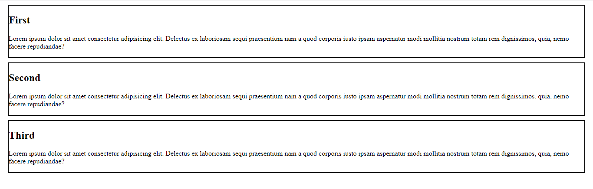
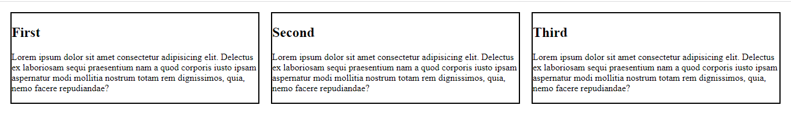

- [Flexbox](#flexbox)
- [Why Flexbox?](#why-flexbox)
- [Specifying what elements to lay out as flexible boxes](#specifying-what-elements-to-lay-out-as-flexible-boxes)
- [The flex model](#the-flex-model)
- [ CSS Flex Container](#css-flex-container)
- [Parent Element (Container)](#parent-element-container)
    - [The flex-direction Property](#the-flex-direction-property)
    - [The flex-wrap Property](#the-flex-wrap-property)
    - [The flex-flow Property](#the-flex-flow-property)
    - [The justify-content Property](#the-justify-content-property)
    - [The align-items Property](#the-align-items-property)
- [Summary](#summary)
- [Resources](#resources)
# Flexbox

Flexbox is a one-dimensional layout method for arranging items in rows or columns. Items flex (expand) to fill additional space or shrink to fit into smaller spaces.

# Why Flexbox?
For a long time, the only reliable cross-browser compatible tools available for creating CSS layouts were features like floats and positioning. These work, but in some ways they're also limiting and frustrating.

The following simple layout designs are either difficult or impossible to achieve with such tools in any kind of convenient, flexible way:

Vertically centering a block of content inside its parent.
Making all the children of a container take up an equal amount of the available width/height, regardless of how much width/height is available.
Making all columns in a multiple-column layout adopt the same height even if they contain a different amount of content.

Lets See a flexbox use case

```html
<!DOCTYPE html>
<html lang="en">
<head>
    <meta charset="UTF-8">
    <meta http-equiv="X-UA-Compatible" content="IE=edge">
    <meta name="viewport" content="width=device-width, initial-scale=1.0">
    <title>Document</title>
    <style>
    section{
            border: 2px solid black;
            margin: 10px;
        }
    </style>
</head>
<body>

    <div>
        <section>
            <h1>First</h1>
            <p>
                Lorem ipsum dolor sit amet consectetur adipisicing elit. Delectus ex laboriosam sequi praesentium nam a quod corporis iusto ipsam aspernatur modi mollitia nostrum totam rem dignissimos, quia, nemo facere repudiandae?
            </p>
        </section>
        <section>
            <h1>Second</h1>
            <p>
                Lorem ipsum dolor sit amet consectetur adipisicing elit. Delectus ex laboriosam sequi praesentium nam a quod corporis iusto ipsam aspernatur modi mollitia nostrum totam rem dignissimos, quia, nemo facere repudiandae?
            </p>
        </section>
        <section>
            <h1>Third</h1>
            <p>
                Lorem ipsum dolor sit amet consectetur adipisicing elit. Delectus ex laboriosam sequi praesentium nam a quod corporis iusto ipsam aspernatur modi mollitia nostrum totam rem dignissimos, quia, nemo facere repudiandae?
            </p>
        </section>
    </div>
</body>
</html>
```

So above HTML code will look like



Now We're going to use Flexbox to create a fairly standard three column layout.

Apply this css property on `<div>`
```css
display: flex;
```



So let's understand what's happend above

# Specifying what elements to lay out as flexible boxes
To start with, we need to select which elements are to be laid out as flexible boxes. To do this, we set a special value of display on the parent element of the elements you want to affect.
In this case we want to lay out the `<section> `elements, so we set this on the `<div>`:

This causes the `<div>` element to become a flex container and its children to become flex items.

So, this single declaration gives us everything we need. Incredible, right? We have our multiple column layout with equal-sized columns, and the columns are all the same height. This is because the default values given to flex items (the children of the flex container) are set up to solve common problems such as this.

To be clear, let's reiterate what is happening here. The element we've given a display value of flex to is acting like a block-level element in terms of how it interacts with the rest of the page, but its children are laid out as flex items. The next section will explain in more detail what this means. Note also that you can use a display value of inline-flex if you wish to lay out an element's children as flex items, but have that element behave like an inline element.

# The flex model
When elements are laid out as flex items, they are laid out along two axes:

.png)


# CSS Flex Container
## Parent Element (Container)

The flex container properties are:

1. flex-direction
2. flex-wrap
3. flex-flow
4. justify-content
5. align-items
6. align-content

## The flex-direction Property
The flex-direction property defines in which direction the container wants to stack the flex items.

So we know our page looks like this right now


Now lets say we make `<div>` a flexbox so it will look like:


This is because the default direction of flexbox is row

So if we change `flex-direction` to say `column-reverse` then page will look like:


The values of `flex-direction` is given below:

```css
flex-direction: row; /*default*/
 flex-direction: column;
 flex-direction: column-reverse;
 flex-direction: row;
 flex-direction: row-reverse;
```

## The flex-wrap Property

The flex-wrap property specifies whether the flex items should wrap or not.

1. The wrap value specifies that the flex items will wrap if necessary:

```css
flex-wrap: wrap;
```

Obviously flex-direction , flex-wrap etc will work only when the container is a flexbox.

2. The nowrap value specifies that the flex items will not wrap (this is default):

```css
flex-wrap: nowrap;
```

3. The wrap-reverse value specifies that the flexible items will wrap if necessary, in reverse order:
```css
flex-wrap: wrap-reverse;
```

## The flex-flow Property
The flex-flow property is a shorthand property for setting both the flex-direction and flex-wrap properties.

```css
flex-flow: row wrap;
```

## The justify-content Property
The justify-content property is used to align the flex items:

The center value aligns the flex items at the center of the container:
```css
justify-content: center;
```
The flex-start value aligns the flex items at the beginning of the container (this is default):
```css
justify-content: flex-start;
```
The flex-end value aligns the flex items at the end of the container:
```css
justify-content: flex-end;
```
The space-around value displays the flex items with space before, between, and after the lines:
```css
justify-content: space-around;
```
The space-between value displays the flex items with space between the lines:
```css
justify-content: space-between;
```
# The align-items Property

The align-items property is used to align the flex items.

The center value aligns the flex items in the middle of the container:
```css
align-items: center;
```
The flex-start value aligns the flex items at the top of the container:
```css
align-items: flex-start;
```
The flex-end value aligns the flex items at the bottom of the container:
```css
align-items: flex-end;
```
The stretch value stretches the flex items to fill the container (this is default):
```css
align-items: stretch;
```
The baseline value aligns the flex items such as their baselines aligns:
```css
align-items: baseline;
```

# Summary 

The CSS Flexbox Container Properties
The following table lists all the CSS Flexbox Container properties:

|Property|	Description|
|--|--|
|align-content|	Modifies the behavior of the flex-wrap property. It is similar to align-items, but instead of aligning flex items, it aligns flex lines|
|align-items|	Vertically aligns the flex items when the items do not use all available space on the cross-axis|
|display	|Specifies the type of box used for an HTML element|
|flex-direction	|Specifies the direction of the flexible items inside a flex container|
|flex-flow	|A shorthand property for flex-direction and flex-wrap|
|flex-wrap	|Specifies whether the flex items should wrap or not, if there is not enough room for them on one flex line|
|justify-content|	Horizontally aligns the flex items when the items do not use all available space on the main-axis|


# Resources

1. [FlexBox](https://css-tricks.com/snippets/css/a-guide-to-flexbox/)

2. [Game on FlexBox](https://flexboxfroggy.com/)